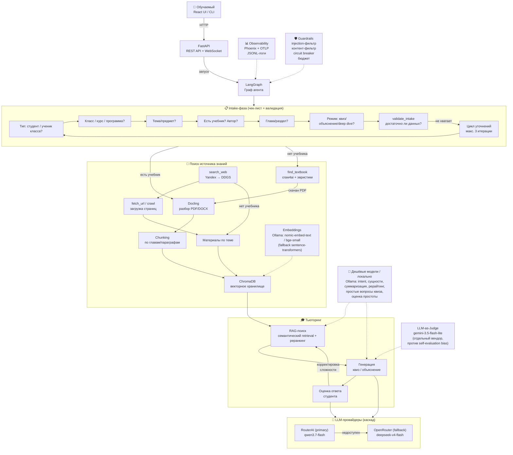
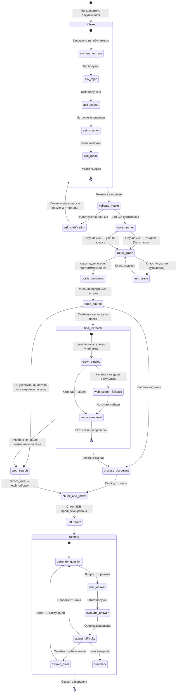

# 📘 EduTutor — Образовательный агент-тьютор

## Спецификация проекта

---

## 1. Проблема и мотивация

**🧩 Проблема:** Ученики и студенты получают учебные материалы (PDF-учебники, методички, лекции), но не имеют инструмента для активной проверки усвоения. Самоподготовка хаотична — нет адаптивных тестов, нет объяснений ошибок, нет структурированного повторения. Школьник не всегда может найти нужный учебник по своей программе (класс, предмет, автор), а поиск в интернете вручную — долгий и ненадёжный.

**⚙️ Почему нужен агент:**
- Автоматический разбор учебника → структурированная база знаний
- **Авто-поиск и скачивание учебника** по классу/предмету/автору, если файл не предоставлен
- Адаптивная генерация квизов по конкретным главам/темам с учётом класса обучаемого
- Объяснение ошибок с привязкой к источнику
- Поиск дополнительной информации, если учебника недостаточно
- **Дешёвый RAG-пайплайн**: локальные embeddings и дешёвые модели для рутинных операций

**🎯 Что он должен делать:**
1. Принять запрос обучаемого (тема, глава, документ, **тип обучаемого: студент / ученик N-го класса**)
2. По **чек-листу** собрать всю необходимую информацию (интервью) и **провалидировать достаточность** данных
3. Загрузить и разобрать учебник через Docling (если предоставлен)
4. Если учебника нет — **самостоятельно найти и скачать его** (craw4ai), иначе собрать материалы по теме
5. Построить RAG-коллекцию по материалам (**дешёвые embeddings**, дешёвые модели для вспомогательных задач)
6. Генерировать адаптивные квизы/тесты с учётом класса и программы
7. Оценивать ответы, объяснять ошибки, корректировать сложность

---

## 2. Архитектура

### 2.1. Общая схема (компоненты)



### 2.2. Граф агента (LangGraph State Machine) — с условными рёбрами



> **Условные рёбра (conditional edges)** реализуются через функции-роутеры LangGraph:
> `route_learner(state)`, `route_grade(state)`, `route_source(state)`, `route_textbook_result(state)`,
> `validate_intake(state)` — см. раздел 5.

---

## 3. Технологический стек

### 3.1. Ядро агента

| Компонент | Технология | Обоснование |
|-----------|-----------|-------------|
| **Агентный фреймворк** | **LangGraph** | Граф состояний с ветвлением, **условными рёбрами** (conditional edges), человеческим вводом (interrupt) — идеально для чек-листа, intake-валидации и адаптивного квиза |
| **Валидация данных** | **PydanticAI** (pydantic v2) | Типизация состояний графа, валидация ответов LLM, structured output |
| **LLM-клиент** | OpenAI SDK (совместимый) | RouterAI / OpenRouter — из `research_guard_agent` (`llm_client.py`), роли tutor/expert/judge/cheap |
| **Локальные LLM/embeddings** | **Ollama** | Дешёвые роли RAG: nomic-embed-text / bge-small (embeddings), qwen2.5:3b / gemma3:4b (intent, сущности, суммаризация) |

### 3.2. Обработка документов

| Компонент | Технология | Обоснование |
|-----------|-----------|-------------|
| **Разбор PDF/DOCX** | **Docling** | Структурированный разбор: заголовки, параграфы, таблицы, формулы → Markdown |
| **Fallback-извлечение** | pdfplumber / PyPDF (из geo_tutor-master) | Для файлов >50 страниц и >10MB — надёжно и экономно по памяти |
| **OCR (резерв)** | EasyOCR | Только для сканированных PDF |
| **Chunking** | Docling HybridChunker + custom | По главам/параграфам с сохранением иерархии (заголовок → контент); обогащение чанка контекстом параграфа (идея из geo_tutor-master) |
| **Embeddings** | **Ollama: nomic-embed-text / bge-small** (fallback: `sentence-transformers/all-MiniLM-L6-v2`) | Локально, бесплатно, без внешних API |
| **Реранкинг** | `cross-encoder/ms-marco-MiniLM-L-6-v2` | Точность поиска ×3–5 (из geo_tutor-master) |

### 3.3. Хранение и поиск

| Компонент | Технология | Обоснование |
|-----------|-----------|-------------|
| **Векторная БД** | **ChromaDB** | Лёгкая, встроенная, без инфраструктуры; из `hybrid-rag-project` и geo_tutor-master |
| **Семантический поиск** | ChromaDB similarity search | top-K по косинусному расстоянию с **метаданными** (class, subject, section_number, source) для фильтрации по классу/главе |
| **Фильтр по классу/главе** | ChromaDB `where` | `section_number`, `grade`, `curriculum`, `subject` — из geo_tutor-master (фильтр по параграфам) |

### 3.4. API и UI

| Компонент | Технология | Обоснование |
|-----------|-----------|-------------|
| **Backend API** | **FastAPI** | Async, OpenAPI/Swagger, WebSocket для стриминга |
| **Frontend** | **React** (Vite) | Современный UI с чатом, загрузкой файлов, визуализацией квизов |
| **Файл-аплоад** | FastAPI `UploadFile` | Приём PDF/DOCX от пользователя |
| **Стриминг** | WebSocket (`/ws`) | Потоковые ответы агента и прогресс поиска учебника |

### 3.5. Веб-скрейпинг и поиск источника

| Компонент | Технология | Обоснование |
|-----------|-----------|-------------|
| **Скрейпинг** | **craw4ai** (async, AI-ориентированный) | Обход страниц каталогов учебников, извлечение ссылок на PDF; примеры паттернов — coleam00/ai-agents-masterclass |
| **Поиск** | search_web (Yandex → Tavily → DDGS) | Из `research_guard_agent` — fallback-цепочка без ключей |
| **Скачивание** | httpx/requests + SSRF-защита | `is_url_blocked()` из `tools.py` |
| **Кэш источников** | локальный `data/sources_cache/` | Хэш URL → файл, экономия трафика и повторных скачиваний |

### 3.6. Наблюдаемость

| Компонент | Технология | Обоснование |
|-----------|-----------|-------------|
| **Трейсинг** | **Phoenix** (Arize) + OpenTelemetry | Из `research_guard_agent` — `tracing.py`, кастомные спаны |
| **Инструментирование LLM** | `openinference-instrumentation-openai` | Авто-трейсы LLM-вызовов |
| **Логи** | Rich + JSONL | `request_id` / `session_id` для трассировки, из `logging_setup.py` |
| **Evals** | Golden set + LLM-as-Judge | Из `research_guard_agent` — `eval_golden.py`, `judge.py` |

### 3.7. Безопасность

| Компонент | Технология | Обоснование |
|-----------|-----------|-------------|
| **Guardrails** | `guardrails.py` (адаптирован) | Injection-фильтр, контент-фильтр, circuit breaker |
| **Лимиты** | MAX_STEPS, MAX_COST_USD, MAX_INTAKE_ITERATIONS | Бюджет, зацикливание, бесконечные уточнения |
| **SSRF-защита** | `is_url_blocked()` | Из `tools.py` — при `fetch_url` и скачивании учебника |
| **Скрейпинг-этика** | robots.txt, rate limiting, User-Agent, кэш | Раздел 6.3 — ограничения и легальность |
| **Валидация ответа** | Pydantic-модели | Структурированный output LLM |

---

## 4. Логика провайдеров, поисковых движков и моделей

> Адаптирована из [config.py](file:///C:/otus/research_guard_agent/src/config.py) и [tools.py](file:///C:/otus/research_guard_agent/src/tools.py)

### 4.1. LLM-провайдеры (каскадный fallback)

```
Primary: RouterAI (LLM_PRIMARY_PROVIDER)
  ├── модель: TUTOR_MODEL (qwen/qwen3.7-flash)
  ├── таймаут: ROUTERAI_TIMEOUT (120с)
  └── при недоступности ↓

Fallback: OpenRouter
  ├── модель: deepseek/deepseek-v4-flash
  ├── таймаут: REQUEST_TIMEOUT (30с)
  └── при недоступности → RuntimeError
```

### 4.2. Роутинг моделей по задачам (полная матрица)

Принцип: **дёшево и быстро — для рутинных операций RAG; качественно — для объяснений и финальной оценки; отдельный вендор — для судейства** (против self-evaluation bias).

#### 4.2.1. Дешёвые / локальные модели (Ollama или дешёвые API-модели)

| Роль | Модель | Где | Обоснование |
|------|--------|-----|-------------|
| **Embeddings** | Ollama `nomic-embed-text` / `bge-small` (локально) | Индексация, RAG-поиск | Бесплатно, мгновенно, не зависит от API. Fallback — sentence-transformers |
| **Intent-классификация** | Ollama `qwen2.5:3b` / `gemma3:4b` (или дешёвая API-модель) | Интент: quiz / explain / deep_dive / homework | Простая классификация, не требует экспертной модели |
| **Извлечение сущностей** | Дешёвая (та же) | Парсинг запроса: тема, класс, предмет, автор, глава | Шаблонная задача NER, дешёвая модель справляется |
| **Суммаризация чанков** | Дешёвая | Компрессия длинных чанков для контекста | Однонаправленная задача, ошибки некритичны (контекст остаётся в RAG) |
| **Рерайтинг вопросов** | Дешёвая | Переформулировка вопросов при повторе/адаптации | Низкий риск, скорость важнее |
| **Генерация простых вопросов квиза** | Дешёвая | Фактологические вопросы по готовому чанку | Шаблонные вопросы по контексту (из ideas_for_project: «дешёвая модель — простые quiz-вопросы») |
| **Оценка простоты ответа** | Дешёвая | Пре-фильтр: ответ слишком короткий/пустой → сразу уточнить | Быстрый отсев, не заменяет финального судью |
| **Fallback-цепочка для рутинных задач** | дешёвая → TUTOR_MODEL | Если дешёвая модель недоступна/дала плохой результат | Graceful degradation без простоя |

> **Почему дешёвая модель оправдана:** задачи детерминированы, объёмные, повторяются на каждом шаге (embeddings — на каждый чанк), ошибка дешёвой модели легко обнаруживается и не влияет на качество финального объяснения. Экономия — порядки долларов на сессию.

#### 4.2.2. Качественные модели (критичные задачи)

| Роль | Модель | Провайдер | Обоснование |
|------|--------|-----------|-------------|
| **Тьютор** (генерация вопросов, объяснения, адаптация) | `TUTOR_MODEL` (qwen3.7-flash) | RouterAI → OpenRouter | Основная рабочая модель: баланс цена/качество |
| **Deep-dive объяснения** (сложные темы, синтез из нескольких глав) | `EXPERT_MODEL` (deepseek-v4-flash) | OpenRouter | Глубокое рассуждение; здесь ошибка дорого стоит пониманию ученика |
| **Финальная оценка ответа ученика** (развёрнутый свободный ответ) | `EXPERT_MODEL` / `TUTOR_MODEL` | RouterAI → OpenRouter | Семантическое сравнение с эталоном; дешёвой модели не доверяем |

> **Почему здесь нужна качественная модель:** deep-dive объяснения и финальная оценка — вершина ценности для обучаемого; ошибки в них напрямую вредят обучению. Стоимость этих вызовов низкая (2–5 вызовов на сессию), поэтому экономия на них неоправданна.

#### 4.2.3. Отдельный судья (другой вендор)

| Роль | Модель | Провайдер | Обоснование |
|------|--------|-----------|-------------|
| **LLM-as-Judge** (качество вопросов, качество объяснений, качество оценки) | `JUDGE_MODEL` (gemini-3.5-flash-lite) | Google (отдельный вендор) | Независимая оценка, **исключён self-evaluation bias** — судья не из стека тьютора |

> Fallback-судья — также другой вендор (JUDGE_FALLBACK_MODELS), чтобы bias не вернулся (логика из `config.py` research_guard_agent).

### 4.3. Поисковые движки (каскадный fallback)

```
SEARCH_PRIMARY (из .env):
  ├── yandex (если YANDEX_API_KEY + YANDEX_FOLDER_ID)
  ├── tavily (если TAVILY_API_KEY)
  └── ddgs — всегда универсальный fallback (без ключей)
```

> Логика 1:1 из `research_guard_agent`: функция `search_web()` с fallback-цепочкой, `fetch_url()` с SSRF-защитой. Для скачивания учебников дополнительно используется **craw4ai** (раздел 6).

---

## 5. Intake-фаза (чек-лист + валидация достаточности)

Агент собирает информацию от обучаемого, **валидирует её достаточность** и запускает цикл уточнений с ограничением по количеству итераций.

### 5.1. Состояние intake (расширенное)

```python
class IntakeState(BaseModel):
    """Состояние intake-фазы — собранная информация об обучаемом."""
    learner_type: Optional[str] = None      # 1. Тип: "student" | "schoolchild"
    grade: Optional[str] = None             # 2. Класс ученика (5-11) — если schoolchild
    curriculum: Optional[str] = None        # 2a. Учебная программа/стандарт (ФГОС и т.п.)
    subject: Optional[str] = None           # 3. Предмет
    topic: Optional[str] = None             # 4. Тема/раздел
    has_textbook: Optional[bool] = None     # 5. Есть ли учебник?
    textbook_file: Optional[str] = None     # 5a. Путь к файлу (если загружен)
    textbook_author: Optional[str] = None   # 5b. Автор учебника (для авто-поиска)
    textbook_url: Optional[str] = None      # 5c. URL (если указан)
    chapter: Optional[str] = None           # 6. Глава/раздел (или "все")
    mode: Optional[str] = None              # 7. Режим: quiz / explain / deep_dive
    difficulty: str = "medium"              # 8. Начальная сложность
    num_questions: int = 10                 # 9. Количество вопросов
    intake_iterations: int = 0              # Счётчик уточняющих итераций
    missing_fields: List[str] = []          # Поля, которые нужно уточнить
```

### 5.2. Валидация достаточности (`validate_intake`)

Узел-валидатор запускается после заполнения чек-листа и определяет, **достаточно ли данных для старта**.

| Поле | Обязательность | Можно ли получить автоматически |
|------|----------------|--------------------------------|
| `learner_type` | **обязательное** | нет — только от пользователя (интервью) |
| `subject` / `topic` | **обязательное** | нет — ядро запроса |
| `mode` | **обязательное** | нет — выбор режима |
| `grade` | обязательное, **если** `learner_type == "schoolchild"` | нет — только от пользователя |
| `has_textbook` | **обязательное** | нет — от пользователя |
| `textbook_author` | опциональное | нет, но **улучшает** авто-поиск учебника |
| `curriculum` | опциональное | **да** — авто-поиск по классу/предмету + ФГОС |
| `chapter` | опциональное (по умолчанию «все») | **да** — парсинг содержания после индексации |
| `textbook_file` / `textbook_url` | условное | **да** — авто-поиск и скачивание (craw4ai) |

**Логика валидатора:**
1. Если `missing_fields` не пусто и `intake_iterations < MAX_INTAKE_ITERATIONS` (по умолчанию 3) → узел `ask_clarification`: задать уточняющие вопросы по недостающим полям, вернуться в intake, инкремент `intake_iterations`.
2. Если `intake_iterations >= MAX_INTAKE_ITERATIONS` → принять **минимально достаточный набор** (topic + mode + learner_type) и перейти к `route_learner` с предупреждением пользователю («работаем без класса, точность ниже»).
3. Если `has_textbook == False` и не указан автор → запустить авто-поиск с **fallback-цепочкой**: учебник по автору → учебник по классу+предмету → материалы по теме.

### 5.3. Сценарии intake

| Сценарий | Поток |
|----------|-------|
| Школьник загрузил PDF | `learner_type=schoolchild` → `grade=6` → `subject=география` → `has_textbook=True` → upload → `chapter` → `mode` → **Docling** |
| Школьник без учебника, автор известен | `grade=6` + `subject` + `textbook_author="Алексеев"` → **find_textbook** (craw4ai) → скачать → Docling |
| Школьник без учебника, только тема | `grade=6` + `topic="Атмосфера"` → **find_textbook** (по классу+предмету) → не найден → **материалы по теме** (search_web) |
| Студент указал тему без учебника | `learner_type=student` → `has_textbook=False` → `chapter="все"` → `mode` → **материалы по теме** (search_web) |
| Студент указал URL | `has_textbook=False` → `textbook_url` → **fetch_url + Docling** |

---

## 6. Авто-поиск и скачивание учебника (craw4ai)

### 6.1. Инструменты

| Инструмент | Описание |
|------------|----------|
| `crawl_textbook_catalog(query, grade, subject)` | **craw4ai**: обход каталогов учебников (11klassov.net и аналоги), извлечение ссылок на страницы учебника и прямые ссылки на PDF |
| `crawl_page_protected(url)` | craw4ai: загрузка страницы с защитой (JS-редиректы, обфускация ссылок, «проверка на человека») — эвристики поиска файла в разметке/JS |
| `search_web(query)` | Поиск источников (Yandex → Tavily → DDGS) |
| `fetch_url(url)` | Загрузка страницы (SSRF-safe) |
| `download_file(url, dest)` | Скачивание PDF с проверкой: размер, сигнатура `%PDF`, число страниц |
| `verify_textbook(file)` | Валидация: открывается ли Docling, есть ли структура (§, главы, оглавление) |

**Эвристики поиска файла внутри защищённой страницы** (паттерны из практики craw4ai / coleam00):
1. Прямые ссылки `<a href="*.pdf">`, `<a href="*.djvu">`, `*.docx` — приоритет.
2. Ссылки вида `/load/...`, `/go?url=...`, `redirect.php?...` — раскрытие через повторный `crawl_page_protected`.
3. Если файл не найден — парсинг `window.__DATA__` / JSON-LD / скрытых `<div>` с путями к файлам.
4. Fallback-эвристика: поиск страницы «скачать PDF» + разбор JS-обработчика кнопки (атрибуты `onclick`, `data-href`).

### 6.2. Fallback-цепочка источников

```
1. Каталоги учебников (11klassov.net и 2–3 аналога) — craw4ai
2. Yandex/DDGS: "учебник {subject} {grade} класс {author} pdf"
3. Сайт издательства / ФГОС-реестр — официальные источники
4. Материалы по теме (если учебник не найден): search_web → fetch_url → индекс
```

Каждый уровень логируется (источник, статус, время) в спане `source.find_textbook`.

### 6.3. Ограничения и этика

- **Легальность:** скачиваем только свободно распространяемые/демо-версии; при отсутствии лицензии — используем материалы по теме вместо учебника; в UI указываем источник.
- **robots.txt:** craw4ai учитывает `robots.txt`; запрещённые разделы не обходим без явного согласия пользователя (настройка `CRAWL4AI_RESPECT_ROBOTS=true` по умолчанию).
- **Rate limiting:** пауза между запросами (по умолчанию 1–2 c, `CRAWL_RATE_LIMIT_SEC`), лимит страниц на сессию (`MAX_CRAWL_PAGES=20`).
- **Кэширование:** скачанные файлы и HTML кэшируются в `data/sources_cache/` по хэшу URL — повторная сессия не качает заново.
- **SSRF:** все URL проходят `is_url_blocked()`.
- **Таймауты:** общий лимит на поиск учебника (`MAX_TEXTBOOK_SEARCH_SEC=300`), прерывание → материалы по теме.

---

## 7. Цикл Reason → Act → Observe

### 7.1. Генерация квиза (с учётом класса обучаемого)

```
REASON  │ Анализ текущего состояния:
        │ • Тип обучаемого (student / schoolchild + grade)
        │ • Какая тема/глава? Какой класс?
        │ • Какой уровень сложности?
        │ • Сколько вопросов осталось?
        │ • Какие темы обучаемый уже знает?
        │ → Решение: generate_question / explain / summarize
        ▼
ACT     │ Выполнение действия:
        │ • RAG-поиск по ChromaDB (фильтр: subject + grade + chapter) → top-K чанков
        │ • Дешёвая модель: простые фактологические вопросы; TUTOR_MODEL: сложные
        │ • Или: LLM объясняет ошибку с цитатой из учебника (EXPERT_MODEL — deep dive)
        ▼
OBSERVE │ Оценка результата:
        │ • Получен ответ обучаемого → пре-оценка простоты (дешёвая) → финальная оценка
        │ • Confidence модели → переключение на expert_model
        │ • Обновление модели знаний обучаемого
        │ • Корректировка сложности (↑ при 3+ правильных, ↓ при 2+ ошибках)
```

### 7.2. Инструменты (function calling)

| Инструмент | Описание | Когда вызывается |
|------------|----------|------------------|
| `search_web(query)` | Поиск информации (Yandex → DDGS) | Нет учебника / дополнение контекста |
| `fetch_url(url)` | Загрузка страницы (SSRF-safe) | После search_web для чтения источника |
| `crawl_textbook_catalog(...)` | Поиск учебника в каталогах (craw4ai) | Нет учебника, есть класс/предмет/автор |
| `crawl_page_protected(url)` | Обход защищённой страницы (craw4ai) | Поиск ссылки на PDF внутри каталога |
| `download_file(url, dest)` | Скачивание PDF с валидацией | Учебник найден |
| `process_document(file)` | Docling → чанки → ChromaDB | Обучаемый загрузил / найден PDF/DOCX |
| `rag_search(query, k)` | Семантический поиск по ChromaDB (фильтр по классу/главе) | Генерация вопроса / объяснение |
| `classify_intent(query)` | Дешёвая модель: intent + сущности | Разбор первичного запроса |
| `save_progress(data)` | Сохранение прогресса обучаемого | После каждого ответа |

---

## 8. API (FastAPI)

### 8.1. Эндпоинты

```python
# Сессии
POST   /api/sessions                    # Создать сессию тьюторинга
GET    /api/sessions/{id}               # Состояние сессии
DELETE /api/sessions/{id}               # Завершить сессию

# Intake
POST   /api/sessions/{id}/intake        # Ответ на вопрос чек-листа (validate_intake → missing_fields)
GET    /api/sessions/{id}/intake/status # Какие поля ещё нужны

# Документы
POST   /api/sessions/{id}/upload        # Загрузить PDF/DOCX
GET    /api/sessions/{id}/knowledge     # Список проиндексированных материалов

# Поиск источника
POST   /api/sessions/{id}/find-textbook # Запустить авто-поиск учебника (класс/предмет/автор)
GET    /api/sessions/{id}/source-status # Статус поиска: каталог → скачивание → Docling

# Взаимодействие (чат)
POST   /api/sessions/{id}/message       # Отправить сообщение (ответ на вопрос)
GET    /api/sessions/{id}/history       # История сообщений

# WebSocket
WS     /api/sessions/{id}/ws            # Стриминг ответов агента и прогресса поиска

# Мониторинг
GET    /api/health                      # Healthcheck
GET    /api/metrics                     # Метрики (Prometheus-формат)
```

---

## 9. UI (React)

### 9.1. Концепция

Современный, тёмный интерфейс в стиле ChatGPT/Claude, но с образовательным уклоном:

- **Левая панель:** список сессий, загруженные/найденные учебники
- **Центр:** чат с агентом (вопросы-ответы, квиз-карточки, прогресс поиска учебника)
- **Правая панель:** прогресс-бар, статистика (% правильных, покрытие тем)

### 9.2. Ключевые компоненты

| Компонент | Функция |
|-----------|---------|
| `IntakeWizard` | Пошаговый чек-лист (тип обучаемого → класс → тема → учебник → глава → режим) с индикатором недостающих полей |
| `SourceSearchPanel` | Статус авто-поиска учебника: каталог → скачивание → проверка → индексация |
| `FileUpload` | Drag & drop PDF/DOCX с превью |
| `QuizCard` | Карточка вопроса с вариантами ответа / свободным полем |
| `ExplanationPanel` | Объяснение с цитатой из учебника (подсветка источника) |
| `ProgressDashboard` | Прогресс по темам, график правильных ответов |
| `ChatStream` | WebSocket-стриминг ответов агента |

---

## 10. Наблюдаемость (Observability)

### 10.1. Дерево спанов в Phoenix

```
edututor.session                            ← корневой (session_id, topic, learner_type, grade)
├── intake.checklist                        ← чек-лист (вопросы → ответы)
├── intake.validate                         ← валидация достаточности (missing_fields)
├── source.find_textbook                    ← авто-поиск учебника (craw4ai, fallback-цепочка)
│   ├── source.crawl_catalog               ← craw4ai по каталогам
│   ├── source.download                    ← скачивание PDF
│   └── source.verify                      ← проверка структуры
├── knowledge.process_document              ← Docling (файл, чанки, время)
│   └── knowledge.chunk_and_index          ← индексация в ChromaDB
├── guardrail.prompt_injection             ← проверка на injection
├── guardrail.content_filter               ← контент-фильтр
├── tutor.generate_question                ← генерация вопроса
│   ├── tool.rag_search                    ← RAG-поиск (query → top-K)
│   └── ChatCompletion                     ← LLM-вызов (авто)
├── tutor.evaluate_answer                  ← оценка ответа
│   ├── cheap.simplicity_check             ← пре-оценка простоты (дешёвая модель)
│   └── ChatCompletion                     ← LLM-вызов
├── tutor.explain_error                    ← объяснение ошибки
│   ├── tool.rag_search                    ← поиск цитаты
│   └── ChatCompletion                     ← LLM (expert_model)
└── guardrail.validate_session             ← валидация итогов
```

### 10.2. Логирование

Из `research_guard_agent` (адаптировано):
- **JSONL** с `request_id` / `session_id` → каждый шаг агента
- **Rich-консоль** → структурированный вывод
- **Файловый лог** → `output/session_<id>/run.log`

### 10.3. Evals

| Тип | Реализация |
|-----|-----------|
| Golden set | `evals/golden_set.json` — сценарии тьюторинга с ожидаемыми вопросами (в т.ч. сценарии «школьник N-го класса», «авто-поиск учебника») |
| LLM-as-Judge | Отдельная модель (gemini, другой вендор) оценивает quality, relevance, difficulty, класс-соответствие |
| Метрики | Время ответа, стоимость (раздельно: дешёвые/качественные/судья), количество шагов, % правильных, успешность find_textbook |

---

## 11. Структура проекта

```
edututor/
├── .env.example                    # шаблон окружения
├── .gitignore
├── requirements.txt                # Python-зависимости
├── README.md                       # описание + архитектура + запуск
├── main.py                         # CLI-запуск
├── serve_phoenix.ps1/.sh           # запуск Phoenix коллектора
│
├── src/
│   ├── __init__.py
│   ├── config.py                   # pydantic Settings (провайдеры, лимиты, craw4ai)
│   ├── llm_client.py              # RouterAI + OpenRouter + Ollama + роли
│   ├── tools.py                    # search_web, fetch_url, rag_search, process_document
│   ├── graph.py                    # LangGraph — граф агента (conditional edges)
│   ├── states.py                   # Pydantic-модели состояний (IntakeState, TutorState)
│   ├── intake.py                   # Чек-лист + validate_intake (достаточность данных)
│   ├── source_finder.py            # craw4ai: поиск/скачивание учебника, fallback-цепочка
│   ├── knowledge.py                # Docling + ChromaDB (обработка документов)
│   ├── cheap_llm.py                # Дешёвые роли: intent, сущности, суммаризация, рерайтинг
│   ├── tutor.py                    # Генерация квизов, оценка ответов, адаптация сложности
│   ├── guardrails.py              # injection-фильтр, контент-фильтр, circuit breaker
│   ├── judge.py                    # LLM-as-Judge (отдельный вендор)
│   ├── metrics.py                  # MetricsCollector
│   ├── tracing.py                  # кастомные OpenInference-спаны
│   └── logging_setup.py           # Rich + JSONL + файловый лог
│
├── api/
│   ├── __init__.py
│   ├── app.py                      # FastAPI application
│   ├── routes/
│   │   ├── sessions.py             # CRUD сессий
│   │   ├── messages.py             # Чат / WebSocket
│   │   ├── intake.py               # Чек-лист / валидация
│   │   ├── source.py               # find-textbook / source-status
│   │   └── documents.py            # Upload / knowledge
│   └── schemas.py                  # Pydantic-модели API
│
├── frontend/                       # React (Vite)
│   ├── src/
│   │   ├── components/
│   │   │   ├── IntakeWizard.jsx
│   │   │   ├── SourceSearchPanel.jsx
│   │   │   ├── FileUpload.jsx
│   │   │   ├── QuizCard.jsx
│   │   │   ├── ExplanationPanel.jsx
│   │   │   ├── ProgressDashboard.jsx
│   │   │   └── ChatStream.jsx
│   │   ├── App.jsx
│   │   └── index.css
│   └── package.json
│
├── tests/                          # unit-тесты
│   ├── test_guardrails.py
│   ├── test_intake.py              # validate_intake, лимит итераций
│   ├── test_source_finder.py       # fallback-цепочка, verify_textbook
│   ├── test_knowledge.py
│   └── test_tutor.py
│
├── evals/
│   └── golden_set.json             # golden set для eval
│
├── examples/
│   └── example_session.md          # пример запроса и результата
│
└── output/                         # результаты прогонов (не в git)
```

---

## 12. Соответствие требованиям курса (7 вопросов)

| # | Вопрос | Ответ для EduTutor |
|---|--------|--------------------|
| 1 | Какую полезную задачу решает агент? | Адаптивный тьюторинг для студентов и **школьников N-го класса**: авто-поиск учебника → разбор → квизы → объяснение ошибок → прогресс |
| 2 | Где агент сам выбирает следующее действие? | LangGraph: **conditional edges** (route_learner, route_grade, route_source, route_textbook_result) + после оценки ответа → следующий вопрос / объяснение / смена сложности / завершение |
| 3 | Когда и почему выбирается каждая модель? | Дешёвая (Ollama) — embeddings/intent/сущности/суммаризация/простые вопросы; Тьютор (qwen3.7-flash) — генерация; Expert (deepseek-v4-flash) — deep dive и финальная оценка; Judge (gemini, др. вендор) — качество |
| 4 | Какой инструмент вызывает модель через function calling? | `rag_search`, `search_web`, `fetch_url`, `crawl_textbook_catalog`, `crawl_page_protected`, `download_file`, `process_document`, `classify_intent`, `save_progress` |
| 5 | Когда агент решает обратиться к памяти? | Перед генерацией каждого вопроса — RAG-поиск по ChromaDB (фильтр по классу/главе). Если нет релевантного — `search_web` для дополнения |
| 6 | Где ветвление, повтор шага и условие остановки? | Ветвление: intake-валидация, тип обучаемого, класс, источник. Повтор: adaptive difficulty, цикл уточнений (≤3). Остановка: MAX_STEPS, бюджет, MAX_INTAKE_ITERATIONS, квиз завершён |
| 7 | Как доказать, что система работает? | Unit-тесты, golden set + LLM-as-Judge, Phoenix трейсы, guardrails, метрики (вкл. успешность find_textbook) в dz_report.md |

---

## 13. Переиспользуемые модули

### 13.1. Из research_guard_agent

| Модуль | Откуда | Что адаптировать |
|--------|--------|------------------|
| `config.py` | [config.py](file:///C:/otus/research_guard_agent/src/config.py) | Добавить TUTOR_MODEL, EXPERT_MODEL, CHEAP_MODEL, OLLAMA_*, CRAWL4AI_*, MAX_INTAKE_ITERATIONS |
| `llm_client.py` | [llm_client.py](file:///C:/otus/research_guard_agent/src/llm_client.py) | 1:1, добавить role="tutor", role="expert", role="cheap" (Ollama endpoint) |
| `tools.py` (search_web, fetch_url) | [tools.py](file:///C:/otus/research_guard_agent/src/tools.py) | 1:1, добавить crawl_*, download_file, rag_search, process_document |
| `guardrails.py` | [guardrails.py](file:///C:/otus/research_guard_agent/src/guardrails.py) | 1:1 (injection, content_filter, circuit breaker) |
| `tracing.py` | [tracing.py](file:///C:/otus/research_guard_agent/src/tracing.py) | Адаптировать span names (edututor.*) |
| `logging_setup.py` | [logging_setup.py](file:///C:/otus/research_guard_agent/src/logging_setup.py) | 1:1, добавить session_id |
| `judge.py` | [judge.py](file:///C:/otus/research_guard_agent/src/judge.py) | Адаптировать критерии: quality, relevance, difficulty, class-соответствие |
| `metrics.py` | [metrics.py](file:///C:/otus/research_guard_agent/src/metrics.py) | Добавить quiz_metrics, source_finder_metrics, cost по ролям |

### 13.2. Из geo_tutor-master (проект заказчика)

| Механика | Откуда | Что переиспользуем в EduTutor |
|----------|--------|-------------------------------|
| **Многоуровневое извлечение PDF** | `pdf_processor.py` | Docling (≤50 стр) → pdfplumber (>50 стр) → OCR (сканы) — авто-выбор по страницам/размеру, экономия памяти |
| **Очистка текста PDF** | `clean_pdf_text()` | Восстановление переносов, удаление колонтитулов, нормализация пробелов с защитой Markdown-таблиц |
| **Детекция параграфов** | `extract_sections()` | Regex `§N`/«Параграф N» → метаданные `section_number`/`section_title`/`source` |
| **Обогащение чанков** | `create_chunks_hybrid()` | Префикс «Параграф N: название» в каждом чанке → точнее RAG |
| **Фильтр по диапазону** | `search_context(..., section_filter)` | ChromaDB `where` по параграфам → расширяем на `grade`/`subject` |
| **Генерация теста JSON** | `generate_test()` | Structured output (single/multiple, explanation, paragraph) + retry + валидация JSON |
| **Оценка ответа** | `check_answer()` | Формат «Оценка 2–5 / пояснение / номер параграфа» + fallback при сбое |
| **Защита от повторов вопросов** | `gen_question()` + `asked_questions` | Anti-repeat по ключевым словам, разнообразие типов вопросов |
| **Реранкинг** | `get_reranker()` | cross-encoder ms-marco-MiniLM — точность поиска |
| **Понятный язык для класса** | `NORMAL_SYSTEM` | Промпт «объясни понятно для ученика 5–6 класса» → параметризуем классом |
| **Экспорт для учителя** | `generated_questions.csv` | Выгрузка вопросов/оценок (опционально) |

---

## 14. Переменные окружения (.env)

```env
# --- LLM-провайдеры ---
ROUTERAI_API_KEY=
ROUTERAI_BASE_URL=https://routerai.ru/api/v1
OPENROUTER_API_KEY=
OPENROUTER_BASE_URL=https://openrouter.ai/api/v1
LLM_PRIMARY_PROVIDER=routerai

# --- Модели ---
TUTOR_MODEL=qwen/qwen3.7-flash         # основная модель тьютора
EXPERT_MODEL=deepseek/deepseek-v4-flash  # для сложных объяснений и финальной оценки
JUDGE_MODEL=google/gemini-3.5-flash-lite # судья (другой вендор)
JUDGE_FALLBACK_MODELS=google/gemini-3.1-flash-lite
FALLBACK_MODELS=deepseek/deepseek-v4-flash,qwen/qwen3.7-flash

# --- Дешёвые/локальные модели (Ollama) ---
OLLAMA_BASE_URL=http://localhost:11434
EMBEDDING_MODEL=nomic-embed-text        # или bge-small (локально, Ollama)
EMBEDDING_FALLBACK=sentence-transformers/all-MiniLM-L6-v2
CHEAP_MODEL=qwen2.5:3b                  # intent, сущности, суммаризация, простые вопросы
CHEAP_FALLBACK_MODEL=gemma3:4b

# --- Поисковые движки ---
YANDEX_API_KEY=
YANDEX_FOLDER_ID=
TAVILY_API_KEY=
SEARCH_PRIMARY=yandex

# --- Скрейпинг учебников (craw4ai) ---
CRAWL4AI_RESPECT_ROBOTS=true
CRAWL_RATE_LIMIT_SEC=1.5
MAX_CRAWL_PAGES=20
MAX_TEXTBOOK_SEARCH_SEC=300
TEXTBOOK_CATALOGS=11klassov.net,znayka.cc,uchebnik-skachatj-besplatno.ru

# --- Хранилище ---
CHROMA_PERSIST_DIR=./data/chroma        # персистентная БД
SOURCES_CACHE_DIR=./data/sources_cache  # кэш скачанных файлов/HTML

# --- Лимиты ---
MAX_STEPS=15
MAX_COST_USD=1.0
MAX_QUESTIONS_PER_SESSION=30
MAX_INTAKE_ITERATIONS=3                 # лимит уточняющих итераций
REQUEST_TIMEOUT=30
ROUTERAI_TIMEOUT=120

# --- Observability ---
PHOENIX_ENABLED=true
PHOENIX_PROJECT_NAME=edututor

# --- API ---
API_HOST=0.0.0.0
API_PORT=8000
```

---

## 15. План реализации (этапы с чек-листами приёмки)

> Сроки относительные (не календарные). Каждый этап завершается чек-листом приёмки — демо на golden set + Phoenix-трейс.

### Этап 1 — Intake и валидация данных · ~1 неделя
**Задачи:** IntakeState (learner_type, grade, subject, topic, textbook_*, mode); чек-лист с interrupt; узел `validate_intake` (обязательные/опциональные поля, missing_fields); цикл уточнений с лимитом MAX_INTAKE_ITERATIONS; `classify_intent` на дешёвой модели (intent + сущности).
**Чек-лист приёмки:**
- [ ] Сценарий «школьник без класса» → агент задаёт уточняющий вопрос про класс, не уходит в бесконечный цикл (≥3 итераций → старт с предупреждением)
- [ ] Сценарий «студент с темой» → проходит без лишних вопросов
- [ ] Интент-классификация распознаёт quiz/explain/deep_dive с accuracy ≥ 0.9 на golden set
- [ ] Phoenix: спаны intake.checklist, intake.validate

### Этап 2 — Парсинг и индексация документов (RAG) · ~1 неделя
**Задачи:** `process_document` (Docling → pdfplumber → OCR, из pdf_processor.py geo_tutor-master); очистка текста; детекция параграфов; обогащение чанков; ChromaDB с метаданными (subject, grade, section_number); локальные embeddings через Ollama (nomic-embed-text/bge-small) + fallback sentence-transformers; реранкинг.
**Чек-лист приёмки:**
- [ ] Учебник 300+ страниц индексируется без OOM (pdfplumber fallback срабатывает)
- [ ] Чанки содержат section_number/section_title/source; фильтр по главе работает
- [ ] Поиск с реранкингом: релевантный чанк в top-3 для 9/10 вопросов golden set
- [ ] Embeddings через Ollama работают без внешних API; fallback включается при недоступности

### Этап 3 — Авто-поиск и скачивание учебника (craw4ai) · ~1.5 недели
**Задачи:** `source_finder.py`: craw4ai по каталогам (11klassov.net и др.), `crawl_page_protected` (эвристики поиска PDF), `download_file` + `verify_textbook`; fallback-цепочка (каталоги → поиск → издательство → материалы по теме); robots.txt, rate limiting, кэш, SSRF, таймауты; UI-панель SourceSearchPanel.
**Чек-лист приёмки:**
- [ ] По «класс 6, география, автор Алексеев» учебник найден и скачан (или честный отказ с fallback на материалы по теме)
- [ ] Защищённая страница каталога обходится минимум 1 эвристикой из 4
- [ ] Повторный поиск той же темы не качает заново (кэш)
- [ ] robots.txt и rate limit соблюдаются; SSRF-блокировки логируются
- [ ] Спан source.find_textbook показывает цепочку источников

### Этап 4 — Тьюторинг-цикл (квиз, объяснения, оценка) · ~1.5 недели
**Задачи:** генерация вопросов (дешёвая модель — простые, TUTOR_MODEL — сложные) с учётом класса; оценка ответов (пре-оценка простоты дешёвой + финальная оценка); объяснение ошибок с цитатой; адаптивная сложность; anti-repeat; JUDGE_MODEL для качества (отдельный вендор).
**Чек-лист приёмки:**
- [ ] Квиз из 5 вопросов: адаптация сложности срабатывает (3+ правильных → ↑)
- [ ] Простые вопросы генерирует дешёвая модель, сложные — TUTOR_MODEL (видно по спанам и стоимости)
- [ ] Оценка свободного ответа использует EXPERT_MODEL; судья-вендор оценивает качество (score ≥ 7)
- [ ] Объяснение ошибки содержит цитату с §N из учебника

### Этап 5 — API + React UI (FastAPI + Vite) · ~1.5 недели
**Задачи:** FastAPI REST + WebSocket; эндпоинты сессий/intake/documents/source/messages; React: IntakeWizard (с индикатором missing_fields), SourceSearchPanel, QuizCard, ExplanationPanel, ProgressDashboard, ChatStream; стриминг прогресса поиска учебника.
**Чек-лист приёмки:**
- [ ] Полный сценарий в UI: чек-лист → авто-поиск учебника → квиз → объяснение → прогресс
- [ ] WebSocket-стриминг работает (ответы и статус поиска)
- [ ] Upload PDF через drag&drop → индексация → статус в UI

### Этап 6 — Guardrails, observability, evals · ~1 неделя
**Задачи:** guardrails (injection, content_filter, circuit breaker, бюджет); Phoenix-трейсы (полное дерево edututor.*); JSONL-логи; golden set (вкл. сценарии школьника и авто-поиска); метрики по ролям моделей; тесты (intake, source_finder, knowledge, tutor, guardrails).
**Чек-лист приёмки:**
- [ ] Prompt-injection блокируется (демо)
- [ ] Golden set: стабильность ≥ 2/3 прогонов (eval_golden.py)
- [ ] Полное дерево спанов в Phoenix для одной сессии
- [ ] Стоимость сессии ≤ MAX_COST_USD; расходы по ролям видны в метриках
- [ ] `python -m pytest tests/ -v` — все тесты зелёные

### Этап 7 — Интеграция, демо, документация · ~1 неделя
**Задачи:** сквозной прогон всех сценариев; README (архитектура + запуск); example_session.md; dz_report.md (соответствие 7 вопросам курса, метрики, выводы); финальное демо.
**Чек-лист приёмки:**
- [ ] Демо-сценарий «школьник 6 класс, география, без учебника» проходит end-to-end
- [ ] Демо-сценарий «студент с PDF» проходит end-to-end
- [ ] dz_report.md содержит метрики (стоимость, успешность поиска, accuracy) и Phoenix-скриншоты

---

## 16. План верификации

### Автоматические тесты

```bash
python -m pytest tests/ -v           # unit-тесты (guardrails, intake, source_finder, knowledge, tutor)
python eval_golden.py --runs 3       # стабильность по golden set
```

### Демонстрация

1. **Intake:** запустить сессию → чек-лист в чате → намеренно не указать класс → уточняющий вопрос → старт
2. **Авто-поиск:** «6 класс, география, Алексеев» без файла → показать цепочку: каталог → скачивание → Docling → чанки
3. **Docling:** загрузить PDF → показать чанки в ChromaDB (метаданные §, класс, предмет)
4. **Квиз:** пройти 5 вопросов → показать адаптацию сложности и роли моделей (дешёвая/тьютор)
5. **Объяснение:** ответить неправильно → объяснение с цитатой и §N
6. **Phoenix:** показать дерево спанов (intake → source → knowledge → tutor)
7. **Guardrails:** попробовать injection → показать блокировку

---

## 17. Референсы

| Источник | Что берём |
|----------|----------|
| [research_guard_agent](file:///C:/otus/research_guard_agent) | Провайдеры, поиск, guardrails, observability, evals — полный стек |
| [hybrid-rag-project](https://github.com/pytanya/hybrid-rag-project) | ChromaDB, гибридный поиск, embeddings |
| [Multi-agents_swarm](https://github.com/pytanya/Multi-agents_swarm) | Опыт мультиагентов (для будущего расширения) |
| coleam00/ai-agents-masterclass | Docling + RAG паттерны (chunking, indexing), **craw4ai-скрейпинг** |
| **geo_tutor-master** (`tmp/geo_tutor-master`) | Пайплайн PDF (Docling/pdfplumber/OCR), очистка текста, параграфы §N, обогащение чанков, генерация теста JSON, оценка ответа, реранкинг, фильтр по параграфам |
| Памятка по проектной работе | Все требования курса |
