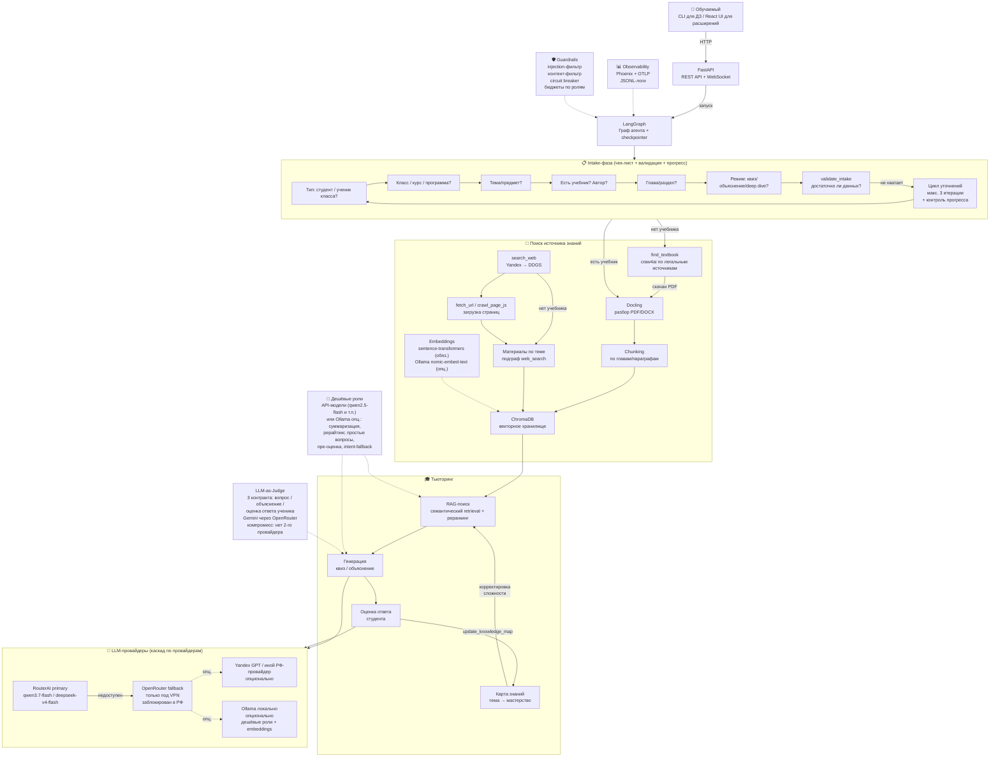

# 📘 EduTutor — Образовательный агент-тьютор

## Спецификация проекта

> **Статус документа:** «контракт для реализации». Все замечания ревью («🧐 Критик») учтены, решения заказчика зафиксированы (раздел 15, 4.2.3).
> **Сверка с кодом:** раздел 13.1 выверен по фактическому коду клона `research_guard_agent` (`C:\otus\project_work\_tmp_gh\research_guard_agent\`), а не по README.
> **Scope для сдачи ДЗ:** см. раздел 15 — явная декомпозиция «MVP для ДЗ» / «расширения заказчика».

---

## 1. Проблема и мотивация

**🧩 Проблема:** Ученики и студенты получают учебные материалы (PDF-учебники, методички, лекции), но не имеют инструмента для активной проверки усвоения. Самоподготовка хаотична — нет адаптивных тестов, нет объяснений ошибок, нет структурированного повторения. Школьник не всегда может найти нужный учебник по своей программе (класс, предмет, автор), а поиск в интернете вручную — долгий и ненадёжный.

**⚙️ Почему нужен агент:**
- Автоматический разбор учебника → структурированная база знаний
- **Авто-поиск учебного материала** по классу/предмету/автору **в реалистичных легальных источниках** (РЭШ, НЭБ, открытые образовательные ресурсы, учебные платформы, конспекты/лекции), если файл не предоставлен
- Адаптивная генерация квизов по конкретным главам/темам с учётом класса обучаемого
- Объяснение ошибок с привязкой к источнику
- Поиск дополнительной информации, если учебника недостаточно
- **Дешёвый RAG-пайплайн**: недорогие embeddings и дешёвые модели для рутинных операций

**🎯 Что он должен делать:**
1. Принять запрос обучаемого (тема, глава, документ, **тип обучаемого: студент / ученик N-го класса**)
2. По **чек-листу** собрать всю необходимую информацию (интервью) и **провалидировать достаточность** данных
3. Загрузить и разобрать учебник через Docling (если предоставлен)
4. Если учебника нет — **найти легальный источник** (craw4ai: dynamic rendering **без обхода защит**; реалистично: конспекты/учебные платформы, а не пиратские «склады»), иначе собрать материалы по теме
5. Построить RAG-коллекцию по материалам (**недорогие embeddings**, дешёвые модели для вспомогательных задач)
6. Генерировать адаптивные квизы/тесты с учётом класса и программы
7. Оценивать ответы, объяснять ошибки, корректировать сложность, вести **карту знаний обучаемого**

> **Объём для ДЗ (формат задания — «схема + краткое описание»):** полный контракт документа — разделы 1–7 и 12; код — консольный демо-прогон одного сценария (см. раздел 15, блок «Scope для ДЗ vs расширения»). React UI, WebSocket, craw4ai-обход — расширения заказчика, в ДЗ не обязательны.

---

## 2. Архитектура

### 2.1. Общая схема (компоненты)



### 2.2. Граф агента (LangGraph State Machine) — с условными рёбрами

```mermaid
stateDiagram-v2
    [*] --> intake: Пользователь подключился

    state intake {
        [*] --> ask_learner_type: Запросить тип обучаемого
        ask_learner_type --> ask_topic: Тип получен
        ask_topic --> ask_source: Тема получена
        ask_source --> ask_chapter: Источник определён
        ask_chapter --> ask_mode: Глава выбрана
        ask_mode --> [*]: Режим выбран
    }

    intake --> validate_intake: Чек-лист заполнен

    validate_intake --> ask_clarification: Недостаточно данных
    ask_clarification --> intake: Уточняющие вопросы (лимит 3 итерации + контроль прогресса)
    validate_intake --> route_learner: Данные достаточны
    validate_intake --> route_learner: Исчерпан лимит итераций или 2 итерации без прогресса - экстренный старт

    state route_learner <<choice>>
    route_learner --> route_grade: Обучаемый — студент (без класса)
    route_learner --> route_grade: Обучаемый — ученик класса

    state route_grade <<choice>>
    route_grade --> grade_curriculum: Класс задан и есть программа/учебник
    route_grade --> ask_grade: Класс не указан (уточнение)
    ask_grade --> route_grade: Класс получен

    grade_curriculum --> route_source: Учебная программа учтена (или fallback без программы)

    state route_source <<choice>>
    route_source --> process_document: Учебник загружен
    route_source --> find_textbook: Учебника нет — авто-поиск (легальные источники)
    route_source --> web_search: Ни учебника, ни автора — материалы по теме

    state find_textbook {
        [*] --> crawl_catalog: craw4ai по легальным платформам РЭШ / НЭБ / конспекты
        crawl_catalog --> verify_download: Материалы по теме найдены
        crawl_catalog --> web_search_fallback: Платформы не дали результата
        web_search_fallback --> verify_download: Источник найден
        verify_download --> [*]: Материалы собраны и проверены
    }

    find_textbook --> process_document: Материалы собраны
    find_textbook --> web_search: Ничего не найдено — материалы по теме

    state web_search {
        [*] --> search_web: Поисковый запрос по теме
        search_web --> fetch_url: Топ-результаты
        fetch_url --> normalize_chunk: Нормализация и чанкинг
        normalize_chunk --> [*]: Коллекция материалов по теме
    }

    web_search --> chunk_and_index: Материалы найдены
    web_search --> source_failed: Пустой результат - материалов нет вообще

    state source_failed {
        [*] --> notify_user: Сообщить пользователю
        notify_user --> offer_upload: Предложить загрузку своего документа
        offer_upload --> [*]: Завершить сессию или ждать файл
    }

    process_document --> chunk_and_index: Docling → чанки
    chunk_and_index --> rag_ready: ChromaDB проиндексирована

    state tutoring {
        [*] --> generate_question
        generate_question --> wait_answer: Вопрос отправлен
        wait_answer --> evaluate_answer: Ответ получен
        evaluate_answer --> update_knowledge_map: Оценка завершена
        update_knowledge_map --> adjust_difficulty: Карта знаний обновлена
        adjust_difficulty --> generate_question: Продолжить квиз
        adjust_difficulty --> explain_error: Ошибка → объяснение
        explain_error --> generate_question: Понял → следующий
        adjust_difficulty --> summary: Квиз завершён
    }

    rag_ready --> tutoring
    tutoring --> [*]: Сессия завершена
    source_failed --> [*]: Сессия завершена без материалов
```



> **Условные рёбра (conditional edges)** реализуются через функции-роутеры LangGraph:
> `route_learner(state)`, `route_grade(state)`, `route_source(state)`, `route_textbook_result(state)`,
> `route_web_search_result(state)` (ветка `source_failed`), `validate_intake(state)` — см. раздел 5.
>
> **Стойкость сессии:** граф исполняется в фоне (asyncio-задача), каждое состояние сохраняется
> checkpointer'ом (SqliteSaver) — см. раздел 8.4 (В-5).

---

## 3. Технологический стек

### 3.1. Ядро агента

| Компонент | Технология | Обоснование |
|-----------|-----------|-------------|
| **Агентный фреймворк** | **LangGraph** | Граф состояний с ветвлением, **условными рёбрами** (conditional edges), человеческим вводом (interrupt), checkpointer — идеально для чек-листа, intake-валидации и адаптивного квиза |
| **Валидация данных** | **PydanticAI** (pydantic v2) | Типизация состояний графа, валидация ответов LLM, structured output, **схемы API-ответов** (раздел 8.2) |
| **LLM-клиент** | OpenAI SDK (совместимый) | База — `llm_client.py` из `research_guard_agent` (роли researcher/judge, каскад провайдеров, retry). **Требует доработки**: роли tutor/expert/cheap (+ опционально Ollama endpoint) (К-3, 13.1) |
| **Локальные LLM/embeddings** | **Ollama — опционально** | **Решение заказчика: Ollama вряд ли понадобится.** По умолчанию дешёвые роли — API-модели на RouterAI; embeddings — `sentence-transformers`. Ollama (`nomic-embed-text`, `qwen2.5:3b`) — опция, включается только при необходимости |

### 3.2. Обработка документов

| Компонент | Технология | Обоснование |
|-----------|-----------|-------------|
| **Разбор PDF/DOCX** | **Docling** | Структурированный разбор: заголовки, параграфы, таблицы, формулы → Markdown |
| **Fallback-извлечение** | pdfplumber / PyPDF (из geo_tutor-master) | Для файлов >50 страниц и >10MB — надёжно и экономно по памяти |
| **OCR (резерв)** | EasyOCR | Только для сканированных PDF |
| **Chunking** | Docling HybridChunker + custom | По главам/параграфам с сохранением иерархии (заголовок → контент); обогащение чанка контекстом параграфа (идея из geo_tutor-master) |
| **Embeddings** | **`sentence-transformers/all-MiniLM-L6-v2` (обязательный)**; Ollama `nomic-embed-text` — **опционально** | Локально, бесплатно, без внешних API; sentence-transformers — основная (без отдельного сервиса) |
| **Реранкинг** | `cross-encoder/ms-marco-MiniLM-L-6-v2` | Точность поиска ×3–5 (из geo_tutor-master) |

> **Примечание (Ж-доп.):** `bge-small` в спецификации ранее — некорректное имя; исключён. **Основной embedding — `sentence-transformers/all-MiniLM-L6-v2`**; Ollama `nomic-embed-text` — опционально. Опция `bge-m3` — на усмотрение реализации, в матрицу не включается.

### 3.3. Хранение и поиск

| Компонент | Технология | Обоснование |
|-----------|-----------|-------------|
| **Векторная БД** | **ChromaDB** | Лёгкая, встроенная, без инфраструктуры; из `hybrid-rag-project` и geo_tutor-master |
| **Семантический поиск** | ChromaDB similarity search | top-K по косинусному расстоянию с **метаданными** (class, subject, section_number, source) для фильтрации по классу/главе |
| **Фильтр по классу/главе** | ChromaDB `where` | `section_number`, `grade`, `curriculum`, `subject` — из geo_tutor-master (фильтр по параграфам) |
| **Checkpointer сессий** | SqliteSaver (LangGraph) | Возобновление графа после долгих операций и перезапусков (В-5) |

### 3.4. API и UI

| Компонент | Технология | Обоснование |
|-----------|-----------|-------------|
| **Backend API** | **FastAPI** | Async, OpenAPI/Swagger, WebSocket для стриминга |
| **Frontend** | **React** (Vite) | **Расширение заказчика** (не входит в ДЗ); чат, загрузка файлов, визуализация квизов |
| **Файл-аплоад** | FastAPI `UploadFile` | Приём PDF/DOCX от пользователя |
| **Стриминг** | WebSocket (`/ws`) — **primary-канал вывода агента** | Потоковые события: вопросы intake, прогресс поиска учебника, квиз-карточки, объяснения |
| **HTTP** | REST — канал ввода и коротких ответов | Ответы ученика, статусы, загрузка файлов (не дублирует WS, см. 8.3) |

### 3.5. Веб-скрейпинг и поиск источника

| Компонент | Технология | Обоснование |
|-----------|-----------|-------------|
| **Скрейпинг** | **craw4ai** (async, AI-ориентированный) | `crawl_page_js` — загрузка страниц, требующих **JS-рендеринга (dynamic rendering)**, **без обхода аутентификации, капчи и ToS-ограниченного доступа** (К-2) |
| **Поиск** | search_web (Yandex → Tavily → DDGS) | Из `research_guard_agent` — fallback-цепочка; **Tavily и OpenRouter заблокированы в РФ** — только под VPN (факт из `.env.example` клона) |
| **Скачивание** | httpx/requests + SSRF-защита | `is_url_blocked()` из `tools.py` |
| **Кэш источников** | локальный `data/sources_cache/` | Хэш URL → файл, экономия трафика и повторных скачиваний |

### 3.6. Наблюдаемость

| Компонент | Технология | Обоснование |
|-----------|-----------|-------------|
| **Трейсинг** | **Phoenix** (Arize) + OpenTelemetry | Из `research_guard_agent` — `tracing.py`, кастомные спаны |
| **Инструментирование LLM** | `openinference-instrumentation-openai` | Авто-трейсы LLM-вызовов |
| **Логи** | Rich + JSONL | `request_id` / `session_id` для трассировки, из `logging_setup.py` |
| **Evals** | Golden set + **EduTutorEval** (новый модуль) | `eval_golden.py` из клона **не адаптируется** (завязан на `ResearchAgent.run`); пишем новый `evals/edututor_eval.py` (В-6, 10.3) |

### 3.7. Безопасность

| Компонент | Технология | Обоснование |
|-----------|-----------|-------------|
| **Guardrails** | `guardrails.py` (адаптирован) | Injection-фильтр, контент-фильтр, circuit breaker |
| **Лимиты** | `MAX_LLM_CALLS_PER_SESSION`, бюджеты по ролям (`CHEAP/TUTOR/JUDGE_ALLOWANCE_USD`), `MAX_QUESTIONS_PER_SESSION`, `MAX_INTAKE_ITERATIONS` | Защита от зацикливания графа и перерасхода бюджета (В-7) |
| **SSRF-защита** | `is_url_blocked()` | Из `tools.py` — при `fetch_url` и скачивании учебника |
| **Скрейпинг-этика** | robots.txt, rate limiting, User-Agent, кэш | Раздел 6.3 — легальность источников и ограничения |
| **Валидация ответа** | Pydantic-модели | Структурированный output LLM; схемы `MessageResponse`/`QuizCard` |

---

## 4. Логика провайдеров, поисковых движков и моделей

> Адаптирована из [config.py](file:///C:/otus/project_work/_tmp_gh/research_guard_agent/src/config.py) и [tools.py](file:///C:/otus/project_work/_tmp_gh/research_guard_agent/src/tools.py) — **сверено с фактическим кодом** (К-3).

### 4.1. LLM-провайдеры (каскадный fallback **по провайдерам**)

```
Primary: RouterAI (LLM_PRIMARY_PROVIDER) — работает в РФ
  ├── модель тьютора: TUTOR_MODEL (qwen/qwen3.7-flash)
  ├── модель эксперта: EXPERT_MODEL (deepseek/deepseek-v4-flash)
  ├── таймаут: ROUTERAI_TIMEOUT (120с)
  └── при недоступности ↓

Fallback: OpenRouter — ЗАБЛОКИРОВАН в РФ, работает только под VPN
  ├── те же модели (fallback по провайдеру, НЕ по моделям)
  ├── таймаут: REQUEST_TIMEOUT (30с)
  ├── судья (JUDGE_MODEL) — Gemini через OpenRouter (компромисс, К-4)
  └── при недоступности ↓

Опционально: Yandex GPT (отдельный ключ YANDEX_GPT_API_KEY — НЕ ключ поиска)
  ├── запасной РФ-провайдер для тьютора/эксперта (без VPN)
  └── решение о подключении — на Этапе 0

Локальный резерв: Ollama (http://localhost:11434/v1, OpenAI-совместимый) — ОПЦИОНАЛЬНО
  └── дешёвые роли (cheap) и embeddings; для тьютора — НЕ используется
      (качество 3B-моделей недостаточно для объяснений). По умолчанию не нужен.
```

> **Факт сверки (доп. факты критика):**
> - `FALLBACK_MODELS` в клоне = те же модели, что и основные (`deepseek-v4-flash-0731`, `qwen3.7-flash`). Fallback «по моделям» на одном шлюзе бессмыслен — **работает только каскад по провайдерам** (RouterAI → OpenRouter → [Yandex GPT] → [Ollama]). Список `FALLBACK_MODELS` оставляем лишь для случая 403/недоступности конкретной модели на шлюзе.
> - Реальная модель в `.env.example` клона — `LLM_MODEL=qwen/qwen3.7-flash`, `ROUTERAI_MODEL=deepseek/deepseek-v4-flash`. Соответствие EduTutor: `TUTOR_MODEL=qwen/qwen3.7-flash`, `EXPERT_MODEL=deepseek/deepseek-v4-flash` — согласовано.
> - **Запасные провайдеры для РФ (без VPN):** RouterAI (основной), **Yandex GPT** (нужен отдельный ключ, см. 4.4), GigaChat, локально Ollama (опционально) — решение по подключению принимается на **Этапе 0** (тест-колл доступности, см. раздел 15).

### 4.2. Роутинг моделей по задачам (полная матрица)

Принцип: **дёшево и быстро — для рутинных операций RAG; качественно — для объяснений и оценки; судья — другая компания-провайдер** (против self-evaluation bias), а не просто другая модель на том же шлюзе (К-4).

#### 4.2.1. Дешёвые / локальные модели (Ollama или дешёвые API-модели)

| Роль | Модель | Где | Fallback-порог / обоснование |
|------|--------|-----|-------------|
| **Embeddings** | **`sentence-transformers/all-MiniLM-L6-v2` (обязательный)**; Ollama `nomic-embed-text` — **опционально** | Индексация, RAG-поиск | Локально, бесплатно, без внешних API. Sentence-transformers — основная (без отдельного сервиса), Ollama — опция (решение заказчика: Ollama вряд ли понадобится) |
| **Intent-классификация** | **`qwen/qwen3.7-flash` (API)** или rule-based/классификатор с few-shot | Интент: quiz / explain / deep_dive / homework | **В-1:** 3B-модель без function-calling на русском NER — слабый кейс; accuracy ≥ 0.9 нереалистична. Порог чек-листа снижен до **0.8**; обязательный fallback — rule-based (ключевые слова: «объясни» → explain, «тест/квиз/вопросы» → quiz и т.п.) |
| **Извлечение сущностей (NER: тема/класс/автор/глава)** | **Шаблонно-регексный парсер + LLM-дополнение** | Парсинг запроса: «6 класс», «Алексеев», «параграф 12» | **В-1:** regex: `(\d{1,2})\s*класс`, списки авторов/предметов; LLM-дополнение только если regex дал пусто. Метрика: **доля запросов с пустым NER** (см. 10.3) |
| **Суммаризация чанков** | Дешёвая API-модель **`google/gemma-3-4b-it`** на RouterAI (подтверждено на Этапе 0) или Ollama `qwen2.5:3b` (**опц.**) | Компрессия длинных чанков для контекста | Ошибки некритичны (контекст остаётся в RAG). Fallback на TUTOR_MODEL при отказе/плохом результате |
| **Рерайтинг вопросов** | Дешёвая (API или Ollama опц.) | Переформулировка вопросов при повторе/адаптации | Низкий риск, скорость важнее |
| **Генерация простых вопросов квиза** | Дешёвая (API или Ollama опц.) | Фактологические вопросы по готовому чанку | Шаблонные вопросы по контексту (из ideas_for_project) |
| **Оценка простоты ответа (пре-фильтр)** | Дешёвая + **rule-based judge-lite** | Ответ слишком короткий/пустой → сразу уточнить | **В-2:** пре-фильтр — ошибка напрямую портит UX. Порядок: (1) rule-based: длина < 20 символов ИЛИ нет ключевых терминов чанка → «пусто/недостаточно»; (2) дешёвая модель; (3) **при отказе дешёвой — TUTOR_MODEL** (порог срабатывания fallback). Метрика «доля отказов дешёвой роли» — 10.3 |

> **В-2 (порог fallback):** дешёвая роль считается отказавшей, если: API/локальный endpoint не ответил за `CHEAP_TIMEOUT_SEC=30`, вернул пустой результат или не прошёл rule-based проверку результата (пустая строка, JSON-инвалидность). В этих случаях роль автоматически заменяется на `TUTOR_MODEL` (для тьютор-функций) или rule-based реализацию (для intent/NER). **Ollama не является обязательным компонентом** (решение заказчика); по умолчанию дешёвые роли — API-модели на RouterAI (например, `qwen/qwen2.5-flash`), локальный Ollama — опция. Время сессии ограничено `SESSION_TIME_BUDGET_SEC` — если Ollama всё же используется на CPU под Windows, он медленный (qwen2.5:3b ≈ 5–15 с/вызов) (доп. факт критика).

#### 4.2.2. Качественные модели (критичные задачи)

| Роль | Модель | Провайдер | Обоснование |
|------|--------|-----------|-------------|
| **Тьютор** (генерация вопросов, объяснения, адаптация) | `TUTOR_MODEL` (qwen3.7-flash) | RouterAI → OpenRouter | Основная рабочая модель: баланс цена/качество |
| **Deep-dive объяснения** (сложные темы, синтез из нескольких глав) | `EXPERT_MODEL` (deepseek-v4-flash) | RouterAI → OpenRouter | Глубокое рассуждение; здесь ошибка дорого стоит пониманию ученика |
| **Финальная оценка ответа ученика** (развёрнутый свободный ответ) | `EXPERT_MODEL` / `TUTOR_MODEL` | RouterAI → OpenRouter | Семантическое сравнение с эталоном; дешёвой модели не доверяем |

#### 4.2.3. Судья (LLM-as-Judge) — контракт для трёх объектов (К-4)

| Объект оценки | Модель | Провайдер | Критерии (0..10 каждый) |
|---------------|--------|-----------|--------------------------|
| **Качество вопроса квиза** | `JUDGE_MODEL` | **RouterAI (Gemini, модель другого семейства)** | `relevance` (соответствие теме/главе), `grade_fit` (соответствие классу: лексика 5–6 vs 10–11), `clarity` (однозначность формулировки), `factual_ok` (нет фактических ошибок) |
| **Качество объяснения** | `JUDGE_MODEL` | **RouterAI (Gemini, модель другого семейства)** | `accuracy` (точность по источнику), `comprehensibility` (понятность для класса), `citation_ok` (есть цитата §N) |
| **Качество оценки ответа ученика** | `JUDGE_MODEL` | **RouterAI (Gemini, модель другого семейства)** | `grade_correct` (оценка корректна), `feedback_ok` (объяснение ошибки полезно), `difficulty_fit` (сложность адаптирована) |

> **К-4 — решение заказчика + результат Этапа 0 (зафиксировано).** «Отдельный вендор» = другая компания-провайдер API (Google / Groq / Anthropic и т.п.), а не просто другое имя модели на том же API-шлюзе. **По факту ключа реального второго провайдера у заказчика нет** — зафиксирован **компромисс**: судья — модель другого семейства (Gemini), доступная **на RouterAI** (тест-колл Этапа 0: `google/gemini-3.5-flash-lite` → 200; `google/gemini-3.1-flash-lite` → 200). Риск self-evaluation bias признаётся и фиксируется в `project_report.md`. Судья работает **без VPN** (не через OpenRouter).
> 1. `JUDGE_MODEL=google/gemini-3.5-flash-lite` — доступна на RouterAI (200, Этап 0). Запасная: `google/gemini-3.1-flash-lite` (тоже 200) — при недоступности основной.
> 2. Fallback-судья (`JUDGE_FALLBACK_MODELS`) — также модель другого семейства (Gemini), чтобы bias не вернулся (логика из `config.py` клона сохранена).
> 3. OpenRouter для судьи — опциональный резерв под VPN, если RouterAI недоступен.

### 4.4. Yandex GPT (опциональный РФ-провайдер)

> **Важно:** ключ Yandex Search API (`YANDEX_API_KEY`, `YANDEX_FOLDER_ID` — для поиска) **НЕ подходит** для Yandex GPT — это разные сервисы Yandex Cloud. Для Yandex GPT нужен **отдельный ключ** (`YANDEX_GPT_API_KEY` + `YANDEX_GPT_FOLDER_ID` / `YANDEX_GPT_CATALOG_ID`) и IAM-токен/API-ключ сервисного аккаунта с ролью на `yandex foundation models`.

```env
# --- Yandex GPT (опционально, запасной РФ-провайдер; ОТДЕЛЬНЫЙ ключ, не поисковый) ---
YANDEX_GPT_API_KEY=            # IAM-токен или API-ключ сервисного аккаунта (foundation models)
YANDEX_GPT_FOLDER_ID=          # каталог Yandex Cloud
YANDEX_GPT_MODEL=yandexgpt-lite # или yandexgpt / yandexgpt-pro
```

- Решение о подключении принимается на **Этапе 0** (тест-колл доступности); используется как запасной провайдер для ролей тьютора/эксперта при недоступности RouterAI без VPN.
- Модель указывается через OpenAI-совместимый endpoint Yandex GPT (или отдельную реализацию) — детали на Этапе 0.

### 4.3. Поисковые движки (каскадный fallback)

```
SEARCH_PRIMARY (из .env):
  ├── yandex (если YANDEX_API_KEY + YANDEX_FOLDER_ID) — работает в РФ
  ├── tavily (если TAVILY_API_KEY) — ЗАБЛОКИРОВАН в РФ, только под VPN
  └── ddgs — всегда универсальный fallback (без ключей)
```

> Логика fallback-цепочки 1:1 из `research_guard_agent` (`search_web()`, `fetch_url()` с SSRF-защитой), **но**:
> - `fetch_url` в клоне возвращает **очищенный текст** (обрезанный до `MAX_FETCH_CHARS=8000`), а не HTML — для Docling и генерации вопросов по учебнику этого недостаточно. Добавляем `fetch_html`/`download_file` (исходный HTML/PDF) и поднимаем `MAX_FETCH_CHARS=32000` (К-3).
> - Для скачивания учебников дополнительно используется **craw4ai** (раздел 6) — только легальные источники.

---

## 5. Intake-фаза (чек-лист + валидация достаточности)

Агент собирает информацию от обучаемого, **валидирует её достаточность** и запускает цикл уточнений с ограничением по количеству итераций **и по прогрессу** (В-3).

### 5.1. Состояние intake (расширенное)

```python
class IntakeState(BaseModel):
    """Состояние intake-фазы — собранная информация об обучаемом."""
    learner_type: Optional[str] = None      # 1. Тип: "student" | "schoolchild"
    grade: Optional[str] = None             # 2. Класс ученика (5-11) — если schoolchild
    curriculum: Optional[str] = None        # 2a. Учебная программа/стандарт (ФГОС и т.п.)
    subject: Optional[str] = None           # 3. Предмет
    topic: Optional[str] = None             # 4. Тема/раздел
    has_textbook: Optional[bool] = None     # 5. Есть ли учебник?
    textbook_file: Optional[str] = None     # 5a. Путь к файлу (если загружен)
    textbook_author: Optional[str] = None   # 5b. Автор учебника (для авто-поиска)
    textbook_url: Optional[str] = None      # 5c. URL (если указан)
    chapter: Optional[str] = None           # 6. Глава/раздел (или "все")
    mode: Optional[str] = None              # 7. Режим: quiz / explain / deep_dive
    difficulty: str = "medium"              # 8. Начальная сложность
    num_questions: int = 10                 # 9. Количество вопросов (потолок MAX_QUESTIONS_PER_SESSION)
    intake_iterations: int = 0              # Счётчик уточняющих итераций
    intake_progress: int = 0                # Число вновь закрытых полей за последнюю итерацию (В-3)
    intake_no_progress_streak: int = 0      # Подряд итераций без прогресса (В-3)
    missing_fields: List[str] = []          # Поля, которые нужно уточнить
```

### 5.2. Валидация достаточности (`validate_intake`)

Узел-валидатор запускается после заполнения чек-листа и определяет, **достаточно ли данных для старта**. **Противоречие снято (В-3):** введены два уровня — «полноценный старт» (таблица ниже) и «экстренный старт» (минимальный набор, см. логику п. 2–3).

| Поле | Обязательность (полноценный старт) | Можно ли получить автоматически |
|------|-----------------------------------|--------------------------------|
| `learner_type` | **обязательное** | нет — только от пользователя (интервью) |
| `subject` / `topic` | **обязательное хотя бы одно** (ядро запроса); для качества желательны оба | нет — ядро запроса |
| `mode` | **обязательное** | нет — выбор режима |
| `grade` | обязательное, **если** `learner_type == "schoolchild"` | нет — только от пользователя |
| `has_textbook` | **обязательное** | нет — от пользователя |
| `textbook_author` | опциональное | нет, но **улучшает** авто-поиск учебника |
| `curriculum` | опциональное | **да** — узел `grade_curriculum`: поиск реестра ФГОС по subject+grade (Ж-1) |
| `chapter` | опциональное (по умолчанию «все») | **да** — парсинг содержания после индексации |
| `textbook_file` / `textbook_url` | условное | **да** — авто-поиск и скачивание (craw4ai, легальные источники) |

**Логика валидатора:**
1. Если `missing_fields` не пусто и `intake_iterations < MAX_INTAKE_ITERATIONS` (по умолчанию 3) → узел `ask_clarification`: задать уточняющие вопросы по недостающим полям, вернуться в intake, инкремент `intake_iterations`.
2. **Контроль прогресса (В-3):** после каждой итерации пересчитывается `intake_progress` (число полей, впервые заполненных за эту итерацию). Если `intake_progress == 0` — `intake_no_progress_streak += 1`, иначе сбрасывается в 0. **Если 2 итерации подряд без прогресса** (например, пользователь отвечает «не знаю») → **экстренный старт**: принять минимально достаточный набор (`topic` или `subject` + `mode` + `learner_type`) и перейти к `route_learner` с предупреждением пользователю («работаем без класса/учебника, точность ниже»).
3. Если `intake_iterations >= MAX_INTAKE_ITERATIONS` → экстренный старт с минимальным набором (п. 2).
4. Если `has_textbook == False` и не указан автор → запустить авто-поиск с **fallback-цепочкой**: материалы по автору → материалы по классу+предмету → материалы по теме (подграф `web_search`).
5. **Материалов нет вообще (В-3):** если `web_search` вернул пустой результат — переход в узел **`source_failed`**: сообщить пользователю, предложить загрузку своего документа (`upload`), при отказе — завершить сессию (состояние логируется в спане `source.source_failed`).

### 5.3. Сценарии intake

| Сценарий | Поток |
|----------|-------|
| Школьник загрузил PDF | `learner_type=schoolchild` → `grade=6` → `subject=география` → `has_textbook=True` → upload → `chapter` → `mode` → **Docling** |
| Школьник без учебника, автор известен | `grade=6` + `subject` + `textbook_author="Алексеев"` → **find_textbook** (craw4ai, легальные платформы) → материалы по теме → Docling |
| Школьник без учебника, только тема | `grade=6` + `topic="Атмосфера"` → **find_textbook** (по классу+предмету) → не найден → **материалы по теме** (подграф web_search) |
| Студент указал тему без учебника | `learner_type=student` → `has_textbook=False` → `chapter="все"` → `mode` → **материалы по теме** (web_search) |
| Студент указал URL | `has_textbook=False` → `textbook_url` → **download_file + Docling** (в клоне `fetch_url` даёт текст, а не HTML — нужен `download_file` для PDF/DOCX) |
| Пользователь отвечает «не знаю» на всё | 2 итерации без прогресса → **экстренный старт** с минимальным набором (В-3) |

---

## 6. Авто-поиск и сбор учебных материалов (craw4ai)

> **К-2 (правовой и технический риск):** инструмент переработан из «обхода проверок» в загрузку JS-страниц **без обхода аутентификации, капчи и доступа, ограниченного по ToS**. Эвристика парсинга `window.__DATA__` (обход «проверки на человека») **удалена**.
>
> **Реальность источников (решение заказчика):** полный PDF учебника с сайта издательства («Просвещение» и др.) легально **не скачать** — издательства продают/предоставляют учебники по лицензиям (для школ), открытого легального PDF нет. Поэтому **find_textbook ориентирован не на «скачать учебник целиком», а на сбор материалов по теме** с легальных образовательных платформ (РЭШ, НЭБ, открытые конспекты/лекции/уроки). Если пользователь не загрузил учебник сам — агент собирает коллекцию материалов по теме (подграф `web_search`), а не ищет пиратский PDF.

### 6.1. Инструменты

| Инструмент | Описание |
|------------|----------|
| `crawl_textbook_catalog(query, grade, subject)` | **craw4ai**: обход каталогов-агрегаторов учебников **только как источника ссылок на официальные ресурсы** (РЭШ, НЭБ, образовательные платформы, сайты издательств — страницы с демо-материалами), извлечение ссылок на страницы материалов/демо-глав |
| `crawl_page_js(url)` | craw4ai: загрузка страниц, требующих **JS-рендеринга (dynamic rendering)**. **Без** обхода аутентификации, капчи и доступа, ограниченного по ToS |
| `search_web(query)` | Поиск источников (Yandex → Tavily → DDGS) |
| `fetch_url(url)` | Загрузка страницы (SSRF-safe) — возвращает **очищенный текст** (как в клоне) |
| `fetch_html(url)` | **Новое:** возвращает исходный HTML (для парсинга ссылок и передачи Docling-подобным парсерам), лимит `MAX_FETCH_CHARS_HTML` |
| `download_file(url, dest)` | Скачивание PDF/DOCX с проверкой: размер, сигнатура `%PDF`, число страниц (только для легально доступных файлов) |
| `verify_textbook(file)` | Валидация: открывается ли Docling, есть ли структура (§, главы, оглавление) |

**Эвристики сбора материалов (JS-рендеринг, без обхода защит):**
1. Прямые ссылки на материалы: страницы параграфов/уроков, `<a href="*.pdf">`, `<a href="*.docx">` на **легальных платформах** (РЭШ, НЭБ, открытые конспекты) — приоритет; проверка, что целевой хост — лицензионно допустимый (раздел 6.3).
2. Ссылки-редиректы вида `/go?url=...`, `redirect.php?...` — раскрытие через повторный `crawl_page_js` (только если финальный URL проходит лицензионный фильтр).
3. Поиск страницы «конспект/урок/параграф» + разбор атрибутов `onclick` / `data-href` (в рамках dynamic rendering).
4. Если целевой контент недоступен легально — **честный отказ** с переходом к следующему источнику (никаких обходов капчи/авторизации, никаких пиратских «складов»).

### 6.2. Fallback-цепочка источников (реалистичная)

```
1. Легальные образовательные платформы и библиотеки:
   РЭШ (resh.edu.ru), НЭБ, открытые конспекты/лекции/уроки, учебные платформы — craw4ai
2. Демо-материалы издательств (страницы учебника с демо-главами/фрагментами)
   — только если доступны легально и без аутентификации
3. Каталоги-«склады» (11klassov.net и аналоги) — ТОЛЬКО как источник ССЫЛОК
   на официальные ресурсы; прямого скачивания с них нет
4. Yandex/DDGS: "тема {topic} {subject} {grade} класс конспект урок" — материалы по теме
5. Материалы по теме (если учебник/конспекты не найдены): подграф web_search → fetch_url → индекс
```

Каждый уровень логируется (источник, статус, время, решение по лицензии) в спане `source.find_textbook`. **Успех сценария find_textbook для ДЗ = собрана коллекция материалов по теме** (не обязательно полный PDF учебника).

### 6.3. Ограничения и этика (К-2, переработано)

- **Легальность источников — жёсткое правило:** материалы собираются **только с легальных источников**: РЭШ, НЭБ, открытые образовательные платформы, ресурсы с явной лицензией на свободное распространение/демо-доступ. **Каталоги-«склады» (11klassov.net и т.п.) используются исключительно как источник ссылок на официальные ресурсы**; скачивание контента с них напрямую запрещено (лицензионный риск). В UI/отчёте указывается источник.
- **Полный PDF учебника:** легально не распространяется издательствами — **не ищем и не скачиваем**; работаем с материалами по теме (конспекты, уроки, демо-главы).
- **robots.txt:** craw4ai учитывает `robots.txt`; запрещённые разделы **не обходим никогда** (`CRAWL4AI_RESPECT_ROBOTS=true` по умолчанию, без «явного согласия пользователя» как исключения).
- **Капча и аутентификация:** **не обходим** (никаких решений капчи, обхода логинов, скрытых эндпоинтов). Страница, требующая аутентификации/капчи, помечается как «недоступна легально» → следующий источник.
- **Rate limiting:** пауза между запросами (по умолчанию 1–2 c, `CRAWL_RATE_LIMIT_SEC`), лимит страниц на сессию (`MAX_CRAWL_PAGES=20`).
- **Кэширование:** скачанные файлы и HTML кэшируются в `data/sources_cache/` по хэшу URL — повторная сессия не качает заново.
- **SSRF:** все URL проходят `is_url_blocked()`.
- **Таймауты:** общий лимит на сбор материалов (`MAX_TEXTBOOK_SEARCH_SEC=300`), прерывание → материалы по теме; долгий сбор прерывается через `POST /cancel` (раздел 8).
- **Хрупкость разметки:** отсутствие обхода капчи снимает зависимость от «защитных» эвристик, которые ломаются при смене разметки; парсинг опирается только на стандартные HTML-структуры (ссылки/редиректы).

---

## 7. Цикл Reason → Act → Observe

### 7.1. Генерация квиза (с учётом класса обучаемого)

```
REASON  │ Анализ текущего состояния:
        │ • Тип обучаемого (student / schoolchild + grade)
        │ • Какая тема/глава? Какой класс?
        │ • Какой уровень сложности? (difficulty ↔ класс, Ж-3)
        │ • Сколько вопросов осталось? (num_questions ≤ MAX_QUESTIONS_PER_SESSION)
        │ • Карта знаний обучаемого: knowledge_map[тема] → мастерство (Ж-6)
        │ → Решение: generate_question / explain / summarize
        ▼
ACT     │ Выполнение действия:
        │ • RAG-поиск по ChromaDB (фильтр: subject + grade + chapter) → top-K чанков
        │ • Дешёвая модель: простые фактологические вопросы; TUTOR_MODEL: сложные
        │ • Или: LLM объясняет ошибку с цитатой из учебника (EXPERT_MODEL — deep dive)
        │ • Промпт параметризуется: grade_prompt(grade) + curriculum (Ж-1, Ж-3)
        ▼
OBSERVE │ Оценка результата:
        │ • Получен ответ обучаемого → пре-оценка простоты
        │   (rule-based judge-lite → дешёвая → fallback TUTOR_MODEL, В-2)
        │ • Финальная оценка (EXPERT_MODEL) + судья по контракту
        │   «оценка ответа ученика» (К-4)
        │ • update_knowledge_map: knowledge_map[тема] обновляется (Ж-6)
        │ • Корректировка сложности (↑ при 3+ правильных, ↓ при 2+ ошибках,
        │   с учётом knowledge_map)
```

**`grade_prompt(grade)` — параметризация «понятного языка» (Ж-3):**

| `difficulty` | Классы | Характеристики лексики и вопросов |
|--------------|--------|-----------------------------------|
| `easy` | 5–6 | Простые слова, короткие предложения, без абстрактных терминов; вопросы: один факт/шаг |
| `medium` | 7–9 | Средний уровень; допускаются термины из учебника; вопросы: понимание, 2 шага |
| `hard` | 10–11 | Анализ и синтез, терминология; вопросы: multiple-correct, причинно-следственные |

Функция `grade_prompt(grade) -> str` возвращает фрагмент system-промпта генерации/объяснения в зависимости от класса; `difficulty` — стартовая сложность квиза, далее адаптируется.

**`update_knowledge_map` (Ж-6):** узел между `evaluate_answer` и `adjust_difficulty`. Обновляет `knowledge_map[тема]` по формуле экспоненциального сглаживания: `мастерство = 0.7*текущее + 0.3*результат_вопроса` (результат 0..1), где «тема» = метка чанка/главы. Используется для выбора следующих вопросов (слабые темы приоритетнее) и для итоговой сводки.

### 7.2. Инструменты (function calling)

| Инструмент | Описание | Когда вызывается |
|------------|----------|------------------|
| `search_web(query)` | Поиск информации (Yandex → DDGS) | Нет учебника / дополнение контекста |
| `fetch_url(url)` | Загрузка страницы как текста (SSRF-safe) | После search_web для чтения источника |
| `fetch_html(url)` | Загрузка исходного HTML (SSRF-safe) | Парсинг ссылок каталога, передача парсерам |
| `crawl_textbook_catalog(...)` | Поиск учебника в каталогах-агрегаторах (craw4ai, только как указатель) | Нет учебника, есть класс/предмет/автор |
| `crawl_page_js(url)` | Загрузка JS-рендеримых страниц **без обхода защит** (craw4ai) | Поиск ссылки на PDF на официальном ресурсе |
| `download_file(url, dest)` | Скачивание PDF/DOCX с валидацией | Учебник найден на легальном источнике |
| `process_document(file)` | Docling → чанки → ChromaDB | Обучаемый загрузил / найден PDF/DOCX |
| `rag_search(query, k)` | Семантический поиск по ChromaDB (фильтр по классу/главе) | Генерация вопроса / объяснение |
| `classify_intent(query)` | Интент: rule-based/классификатор с few-shot + fallback (В-1) | Разбор первичного запроса |
| `extract_entities(query)` | NER: шаблонно-регексный парсер + LLM-дополнение (В-1) | Парсинг темы/класса/автора/главы |
| `save_progress(data)` | Сохранение прогресса обучаемого | После каждого ответа |

---

## 8. API (FastAPI)

### 8.1. Эндпоинты

```python
# Сессии
POST   /api/sessions                    # Создать сессию тьюторинга
GET    /api/sessions/{id}               # Состояние сессии
DELETE /api/sessions/{id}               # Завершить сессию

# Intake
POST   /api/sessions/{id}/intake        # Ответ на вопрос чек-листа → IntakeStatusResponse
GET    /api/sessions/{id}/intake/status # Какие поля ещё нужны → IntakeStatusResponse

# Документы
POST   /api/sessions/{id}/upload        # Загрузить PDF/DOCX
GET    /api/sessions/{id}/knowledge     # Список проиндексированных материалов

# Поиск источника
POST   /api/sessions/{id}/find-textbook # Запустить авто-поиск учебника (класс/предмет/автор)
GET    /api/sessions/{id}/source-status # Статус поиска: каталог → скачивание → Docling

# Взаимодействие (чат)
POST   /api/sessions/{id}/message       # Ответ ученика / короткий запрос → MessageResponse
POST   /api/sessions/{id}/cancel        # Отмена долгой задачи (find_textbook до 300с) (В-5)
GET    /api/sessions/{id}/history       # История сообщений

# WebSocket — primary-канал стриминга событий агента
WS     /api/sessions/{id}/ws            # события intake.question / source.progress / quiz.card / ...

# Мониторинг
GET    /api/health                      # Healthcheck
GET    /api/metrics                     # Метрики (Prometheus-формат)
```

### 8.2. Pydantic-схемы ответов (В-4)

```python
class IntakeStatusResponse(BaseModel):
    """Ответ intake-эндпоинтов — закрывает разрыв API ↔ IntakeWizard (missing_fields)."""
    missing_fields: List[str]           # поля, которые нужно уточнить
    next_question: str                  # текст следующего вопроса чек-листа (или "")
    complete: bool                      # True — данные достаточны, intake завершён

class QuizCard(BaseModel):
    question_id: str
    question: str
    options: Optional[List[str]] = None # для single/multiple; None — открытый вопрос
    answer_type: Literal["single", "multiple", "open"]
    difficulty: Literal["easy", "medium", "hard"]
    topic: str                          # тема/глава для карты знаний

class MessageResponse(BaseModel):
    """Единая схема ответа POST /message — тип + полезная нагрузка."""
    type: Literal[
        "intake_question",  "source_progress", "quiz_card",
        "explanation",      "summary",         "system",
        "error",
    ]
    payload: Dict[str, Any]             # для quiz_card — QuizCard; для explanation —
                                        # {text, citation: {paragraph, source}}; и т.д.
```

### 8.3. Протокол WebSocket-событий (В-4)

WS — **primary-канал вывода агента** (стриминг); HTTP — канал ввода ученика и коротких запросов-ответов. **Разделение ролей убирает дублирование `POST /message` и `/ws`** (В-5): HTTP принимает действия пользователя, WS доставляет события агента.

```python
class WsEvent(BaseModel):
    event: Literal[
        "intake.question",    # {question: str, missing_fields: [...]}
        "source.progress",    # {stage: "catalog"|"download"|"verify"|"index", url: str, status: str}
        "quiz.card",          # QuizCard
        "tutor.explanation",  # {text, citation: {paragraph, source}}
        "tutor.summary",      # {correct, total, knowledge_map}
        "session.error",      # {code, message}
    ]
    data: Dict[str, Any]
```

### 8.4. Шаблон исполнения графа с WebSocket (В-5)

```
POST /message (ответ ученика)
  └─▶ asyncio.create_task(graph.astream(input, config={"checkpointer": SqliteSaver(...)}))
        │   каждое событие узла (intake.question, source.progress, quiz.card,
        │   tutor.explanation, tutor.summary) публикуется в asyncio.Queue сессии
        ▼
WS /api/sessions/{id}/ws  ◀─── asyncio.Queue → отправка WsEvent клиенту
        │
POST /cancel ◀─── task.cancel() + checkpoint сохранён (состояние графа не теряется)
```

- **Checkpointer (SqliteSaver):** состояние графа сохраняется на каждом шаге — долгий `find_textbook` (до 300 с) не блокирует соединение: WS получает промежуточные события `source.progress`, а граф может быть прерван/возобновлён.
- **Primary-каналы:** WS — стриминг (вопросы intake, прогресс поиска, квиз-карточки, объяснения); HTTP — ввод (ответы ученика, upload, cancel, статусы).
- **POST /cancel** — отмена долгой задачи; повторный запуск продолжает с сохранённого checkpoint.

---

## 9. UI (React)

> **Расширение заказчика** — не входит в MVP для ДЗ (раздел 15). Для ДЗ достаточно CLI-прогона сценария.

### 9.1. Концепция

Современный, тёмный интерфейс в стиле ChatGPT/Claude, но с образовательным уклоном:

- **Левая панель:** список сессий, загруженные/найденные учебники
- **Центр:** чат с агентом (вопросы-ответы, квиз-карточки, прогресс поиска учебника)
- **Правая панель:** прогресс-бар, статистика (% правильных, карта знаний по темам)

### 9.2. Ключевые компоненты

| Компонент | Функция | Зависимость от API |
|-----------|---------|--------------------|
| `IntakeWizard` | Пошаговый чек-лист (тип → класс → тема → учебник → глава → режим) с индикатором недостающих полей | `GET /intake/status` → `IntakeStatusResponse.missing_fields` (В-4) |
| `SourceSearchPanel` | Статус авто-поиска учебника: каталог → скачивание → проверка → индексация | WS-событие `source.progress` |
| `FileUpload` | Drag & drop PDF/DOCX с превью | `POST /upload` |
| `QuizCard` | Карточка вопроса (single/multiple/open) | WS-событие `quiz.card` → `QuizCard` (В-4) |
| `ExplanationPanel` | Объяснение с цитатой из учебника (подсветка источника) | WS-событие `tutor.explanation` |
| `ProgressDashboard` | Прогресс по темам (knowledge_map), график правильных ответов | `GET /sessions/{id}` |
| `ChatStream` | WebSocket-стриминг событий агента | WS `/api/sessions/{id}/ws` |

---

## 10. Наблюдаемость (Observability)

### 10.1. Дерево спанов в Phoenix

```
edututor.session                            ← корневой (session_id, topic, learner_type, grade)
├── intake.checklist                        ← чек-лист (вопросы → ответы)
├── intake.validate                         ← валидация достаточности (missing_fields, прогресс intake)
├── source.find_textbook                    ← сбор учебных материалов (craw4ai, fallback-цепочка)
│   ├── source.crawl_catalog               ← craw4ai по легальным платформам (РЭШ/НЭБ/конспекты)
│   ├── source.download                    ← скачивание легально доступных файлов
│   ├── source.license_check               ← проверка лицензионной чистоты источника (К-2)
│   ├── source.verify                      ← проверка структуры
│   └── source.source_failed               ← материалов нет вообще (В-3)
├── knowledge.process_document              ← Docling (файл, чанки, время)
│   └── knowledge.chunk_and_index          ← индексация в ChromaDB
├── guardrail.prompt_injection             ← проверка на injection
├── guardrail.content_filter               ← контент-фильтр
├── tutor.generate_question                ← генерация вопроса
│   ├── tool.rag_search                    ← RAG-поиск (query → top-K)
│   └── ChatCompletion                     ← LLM-вызов (авто)
├── tutor.evaluate_answer                  ← оценка ответа
│   ├── cheap.simplicity_check             ← пре-оценка простоты (rule-based → дешёвая → fallback)
│   └── ChatCompletion                     ← LLM-вызов
├── tutor.update_knowledge_map             ← обновление карты знаний (Ж-6)
├── tutor.explain_error                    ← объяснение ошибки
│   ├── tool.rag_search                    ← поиск цитаты
│   └── ChatCompletion                     ← LLM (expert_model)
├── judge.question_judge                   ← судья: качество вопроса (К-4)
├── judge.explanation_judge                ← судья: качество объяснения (К-4)
├── judge.evaluation_judge                 ← судья: качество оценки ответа ученика (К-4)
└── guardrail.validate_session             ← валидация итогов
```

### 10.2. Логирование

Из `research_guard_agent` (адаптировано):
- **JSONL** с `request_id` / `session_id` → каждый шаг агента
- **Rich-консоль** → структурированный вывод
- **Файловый лог** → `output/session_<id>/run.log`

### 10.3. Evals (В-6, переработано)

| Тип | Реализация |
|-----|-----------|
| Golden set | `evals/golden_set.json` — сценарии тьюторинга: «школьник 6 класса», «студент с PDF», «авто-поиск учебника», «нет материалов вообще» |
| **EduTutorEval (НОВЫЙ модуль)** | `evals/edututor_eval.py` — **не адаптация** `eval_golden.py` из клона (тот жёстко завязан на `ResearchAgent.run(question)` + `check_pass_at_1` по ключевым словам). EduTutorEval прогоняет **последовательность шагов сценария** (intake → источник → квиз → оценка → судья) и считает метрики: `intake_success`, `find_textbook_success`, `judge_score_question`, `judge_score_explanation`, `judge_score_evaluation` |
| LLM-as-Judge | Три контракта судьи (К-4): вопрос / объяснение / оценка ответа ученика; судья — модель другого семейства (см. 4.2.3) |
| Метрики | Время ответа, стоимость **по ролям** (cheap/tutor/expert/judge), число LLM-вызовов за сессию, % правильных, успешность find_textbook, **доля отказов дешёвой роли** (В-2), **доля запросов, где NER вернул пусто** (В-1), точность intent ≥ 0.8 |

---

## 11. Структура проекта

```
edututor/
├── .env.example                    # шаблон окружения
├── .gitignore
├── requirements.txt                # Python-зависимости
├── README.md                       # описание + архитектура + запуск (Quickstart)
├── main.py                         # CLI-запуск (MVP для ДЗ: консольный прогон сценария)
├── serve_phoenix.ps1/.sh           # запуск Phoenix коллектора
│
├── src/
│   ├── __init__.py
│   ├── config.py                   # pydantic Settings (провайдеры, лимиты, бюджеты по ролям, craw4ai)
│   ├── llm_client.py              # ДОРАБОТКА клона: RouterAI + OpenRouter + роли tutor/expert/cheap (+ Ollama опц.)
│   ├── tools.py                    # РАСШИРЕНИЕ клона: search_web, fetch_url, fetch_html, crawl_*, rag_search, ...
│   ├── graph.py                    # LangGraph — граф агента (conditional edges, checkpointer)
│   ├── states.py                   # Pydantic-модели состояний (IntakeState, TutorState)
│   ├── intake.py                   # Чек-лист + validate_intake (достаточность + прогресс, В-3)
│   ├── source_finder.py            # craw4ai: поиск/скачивание учебника (легальные источники), crawl_page_js
│   ├── knowledge.py                # Docling + ChromaDB (обработка документов)
│   ├── cheap_llm.py                # Дешёвые роли: суммаризация, рерайтинг, простые вопросы, пре-оценка, intent-fallback
│   ├── nlp.py                      # НОВОЕ: rule-based intent + regex-NER + LLM-дополнение (В-1)
│   ├── tutor.py                    # Генерация квизов, оценка ответов, update_knowledge_map, адаптация сложности
│   ├── guardrails.py              # injection-фильтр, контент-фильтр, circuit breaker, бюджеты по ролям
│   ├── judge.py                    # НОВАЯ СХЕМА: три контракта судьи (вопрос/объяснение/оценка) (К-4)
│   ├── metrics.py                  # MetricsCollector + метрики по ролям и отказам дешёвых ролей
│   ├── tracing.py                  # кастомные OpenInference-спаны
│   └── logging_setup.py           # Rich + JSONL + файловый лог
│
├── api/
│   ├── __init__.py
│   ├── app.py                      # FastAPI application
│   ├── routes/
│   │   ├── sessions.py             # CRUD сессий
│   │   ├── messages.py             # Чат / WebSocket / cancel
│   │   ├── intake.py               # Чек-лист / валидация
│   │   ├── source.py               # find-textbook / source-status
│   │   └── documents.py            # Upload / knowledge
│   └── schemas.py                  # IntakeStatusResponse, MessageResponse, WsEvent, QuizCard (В-4)
│
├── frontend/                       # React (Vite) — РАСШИРЕНИЕ ЗАКАЗЧИКА (не входит в ДЗ)
│   ├── src/
│   │   ├── components/
│   │   │   ├── IntakeWizard.jsx
│   │   │   ├── SourceSearchPanel.jsx
│   │   │   ├── FileUpload.jsx
│   │   │   ├── QuizCard.jsx
│   │   │   ├── ExplanationPanel.jsx
│   │   │   ├── ProgressDashboard.jsx
│   │   │   └── ChatStream.jsx
│   │   ├── App.jsx
│   │   └── index.css
│   └── package.json
│
├── tests/                          # unit-тесты
│   ├── test_guardrails.py
│   ├── test_intake.py              # validate_intake, лимит итераций, контроль прогресса
│   ├── test_source_finder.py       # fallback-цепочка, license_check, verify_textbook
│   ├── test_knowledge.py
│   ├── test_nlp.py                 # rule-based intent + regex-NER (В-1)
│   └── test_tutor.py
│
├── evals/
│   ├── golden_set.json             # golden set для eval
│   └── edututor_eval.py            # НОВЫЙ eval-модуль (В-6) — не адаптация eval_golden.py
│
├── examples/
│   └── example_session.md          # пример запроса и результата
│
└── output/                         # результаты прогонов (не в git)
```

### 11.1. Quickstart (запуск) (Ж-5)

Порядок запуска (среда: Windows 10, PowerShell). **Ollama не обязателен** (решение заказчика) — по умолчанию дешёвые роли через API RouterAI, embeddings — sentence-transformers:

```bash
# 1. Phoenix-коллектор (observability)
.\serve_phoenix.ps1                 # http://localhost:6006

# 2. Окружение Python
python -m venv .venv
.\.venv\Scripts\Activate.ps1
pip install -r requirements.txt     # см. таблицу версий ниже

# 3. Конфигурация
copy .env.example .env              # заполнить ROUTERAI_API_KEY (+ OPENROUTER_API_KEY для судьи)

# 4. CLI-прогон (MVP для ДЗ): intake → сбор материалов по теме → квиз → оценка → судья
python main.py --scenario schoolchild_grade6_geography

# 5. API (расширение заказчика)
uvicorn api.app:app --host 0.0.0.0 --port 8000

# 6. Frontend (расширение заказчика)
cd frontend && npm install && npm run dev

# --- Опционально: Ollama (только если решили использовать локальные модели) ---
# ollama pull nomic-embed-text
# ollama pull qwen2.5:3b
# ollama serve                        # http://localhost:11434
```

**Таблица версий (Ж-5):**

| Компонент | Версия | Примечание |
|-----------|--------|------------|
| Python | 3.11 / 3.12 | pydantic v2, pydantic-settings |
| LangGraph | ≥ 0.2 (последняя стабильная) | checkpointer SqliteSaver |
| FastAPI / uvicorn | последняя стабильная | async + WebSocket |
| Docling | последняя стабильная | PDF/DOCX → Markdown |
| craw4ai | последняя стабильная | `crawl_page_js` (dynamic rendering) |
| ChromaDB | последняя стабильная | персистентная, встроенная (отдельный сервис не нужен) |
| sentence-transformers | последняя стабильная | основной embedding (all-MiniLM-L6-v2) |
| Phoenix (arize-phoenix) | последняя стабильная | OTLP-коллектор + openinference-instrumentation-openai |
| Ollama | опционально | CPU-режим медленный: qwen2.5:3b ≈ 5–15 с/вызов — только если включён |

---

## 12. Соответствие требованиям курса (7 вопросов)

| # | Вопрос | Ответ для EduTutor |
|---|--------|--------------------|
| 1 | Какую полезную задачу решает агент? | Адаптивный тьюторинг для студентов и **школьников N-го класса**: авто-поиск учебника в легальных источниках → разбор → квизы → объяснение ошибок → карта знаний → прогресс |
| 2 | Где агент сам выбирает следующее действие? | LangGraph: **conditional edges** (route_learner, route_grade, route_source, route_textbook_result, route_web_search_result) + после оценки ответа → следующий вопрос / объяснение / смена сложности / завершение |
| 3 | Когда и почему выбирается каждая модель? | Дешёвые (API-модели RouterAI, напр. qwen2.5-flash; Ollama — опционально) — суммаризация/рерайтинг/простые вопросы/пре-оценка; rule-based+fallback — intent/NER (В-1); Тьютор (qwen3.7-flash) — генерация; Expert (deepseek-v4-flash) — deep dive и финальная оценка; Judge (Gemini другого семейства через OpenRouter — компромисс, К-4) — 3 контракта качества |
| 4 | Какой инструмент вызывает модель через function calling? | `rag_search`, `search_web`, `fetch_url`, `fetch_html`, `crawl_textbook_catalog`, `crawl_page_js`, `download_file`, `process_document`, `classify_intent`, `extract_entities`, `save_progress` |
| 5 | Когда агент решает обратиться к памяти? | Перед генерацией каждого вопроса — RAG-поиск по ChromaDB (фильтр по классу/главе) + **knowledge_map** (приоритет слабых тем). Если нет релевантного — `search_web` для дополнения |
| 6 | Где ветвление, повтор шага и условие остановки? | Ветвление: intake-валидация, тип обучаемого, класс, источник, `source_failed`. Повтор: adaptive difficulty, цикл уточнений (≤3 **и ≤2 итераций без прогресса**), anti-repeat. Остановка: `MAX_LLM_CALLS_PER_SESSION`, суммарный бюджет `MAX_COST_USD` и бюджеты по ролям, `MAX_QUESTIONS_PER_SESSION`, квиз завершён (В-7) |
| 7 | Как доказать, что система работает? | Unit-тесты, golden set + **EduTutorEval** (новый модуль, В-6), три контракта LLM-as-Judge, Phoenix-трейсы, guardrails, метрики (вкл. успешность find_textbook, отказы дешёвых ролей) в project_report.md |

---

## 13. Переиспользуемые модули

### 13.1. Из research_guard_agent — **сверено с фактическим кодом клона** (К-3)

Формат: «фактическое состояние в клоне» → «что добавляем для EduTutor». Путь клона: `C:\otus\project_work\_tmp_gh\research_guard_agent\`.

| Модуль | Фактическое состояние в клоне (сверено) | Что добавляем для EduTutor |
|--------|----------------------------------------|----------------------------|
| `config.py` | Pydantic `Settings`: провайдеры `routerai`/`openrouter`; `LLM_MODEL=qwen/qwen3.7-flash`; `RESEARCHER_MODEL`; `JUDGE_MODEL`; `ROUTERAI_MODEL`/`OPENROUTER_MODEL`; `FALLBACK_MODELS`; `JUDGE_FALLBACK_MODELS`; поиск yandex/tavily/ddgs; `MAX_STEPS=6`, `MAX_COST_USD=0.5`; таймауты; цены/курс ₽→$ | **Доработка**: + `TUTOR_MODEL`, `EXPERT_MODEL`, `CHEAP_MODEL` (дешёвая **API-модель RouterAI** по умолчанию, напр. `qwen/qwen2.5-flash`); + `EMBEDDING_MODEL=sentence-transformers/all-MiniLM-L6-v2` (обязательный); `OLLAMA_BASE_URL`/`EMBEDDING_OLLAMA`/`CHEAP_TIMEOUT_SEC` — **опционально** (Ollama не обязателен, решение заказчика); + `CRAWL4AI_*`, `MAX_FETCH_CHARS=32000`, `MAX_FETCH_CHARS_HTML`; + `MAX_INTAKE_ITERATIONS`, `MAX_QUESTIONS_PER_SESSION=15`, `MAX_LLM_CALLS_PER_SESSION=60`, `SESSION_TIME_BUDGET_SEC`; + бюджеты по ролям `CHEAP/TUTOR/JUDGE_ALLOWANCE_USD`; комментарий про блокировку OpenRouter в РФ |
| `llm_client.py` | Роли **только** `researcher`/`judge` (`LLMClient(role=...)`); OpenAI SDK; retry с backoff; каскад провайдеров и моделей; подсчёт стоимости (`usage.total_cost` или оценка по токенам). **Ролей tutor/expert/cheap и Ollama-эндпоинта НЕТ** — «добавить role="cheap"» без доработки невозможно | **Доработка (не 1:1)**: добавить роли `tutor` (модель `TUTOR_MODEL`), `expert` (`EXPERT_MODEL`) с тем же каскадом RouterAI→OpenRouter; роль `cheap` — **дешёвая API-модель на RouterAI** (по умолчанию; сигнатура `LLMClient(settings, role="cheap")` → модель `CHEAP_MODEL`); **опционально** — OpenAI-совместимый endpoint Ollama `http://localhost:11434/v1` (ключ любой, напр. `ollama`); у роли `cheap` — отдельный таймаут `CHEAP_TIMEOUT_SEC`; сигнатура остаётся `LLMClient(settings, role)` |
| `tools.py` | `TOOLS_SCHEMA`/`TOOL_FUNCTIONS` содержат **только** `search_web`, `fetch_url`, `save_note`; `fetch_url` возвращает **очищенный текст** (HTML-теги удалены), обрезанный до `MAX_FETCH_CHARS=8000`; SSRF-защита `is_url_blocked()` (3 уровня) | **Расширение реестра** `TOOL_FUNCTIONS` новыми инструментами: `fetch_html` (исходный HTML для парсеров), `crawl_textbook_catalog`, `crawl_page_js`, `download_file`, `verify_textbook`, `process_document`, `rag_search`, `classify_intent`, `extract_entities`, `save_progress`. **Важно:** цепочка «URL → `fetch_url` + Docling» в клоне невозможна (fetch_url отдаёт текст, а не документ) — для учебников используется `download_file` (PDF/DOCX) или `fetch_html`; `MAX_FETCH_CHARS=8000` мало для генерации вопросов по учебнику → поднимаем до 32000 |
| `guardrails.py` | Injection-фильтр, контент-фильтр, circuit breaker, `validate_answer` | 1:1; + валидация Pydantic-схем квиз-карточек и ответов судьи |
| `tracing.py` | Кастомные OpenInference-спаны | Адаптировать span names → `edututor.*` |
| `logging_setup.py` | Rich + JSONL + файловый лог | 1:1, добавить `session_id` |
| `judge.py` | Оценивает **финальный ответ агента** по `factual_accuracy`/`completeness`/`structure` (score 0..10, verdict) — объект оценки ≠ объект EduTutor | **Новая схема критериев** для трёх объектов (К-4): `judge_question` (relevance, grade_fit, clarity, factual_ok), `judge_explanation` (accuracy, comprehensibility, citation_ok), `judge_evaluation` (grade_correct, feedback_ok, difficulty_fit); JSON-парсинг с fallback — переиспользуем из клона |
| `metrics.py` | `MetricsCollector` (LLM-вызовы, шаги, стоимость) | + `quiz_metrics`, `source_finder_metrics`, cost **по ролям** (cheap/tutor/expert/judge), «доля отказов дешёвой роли» (В-2), «доля NER-пусто» (В-1) |
| `eval_golden.py` | Жёстко завязан на `ResearchAgent.run(question)` и `check_pass_at_1` по ключевым словам; `Judge.evaluate(question, result)` | **НЕ адаптируется.** Пишем **новый** модуль `evals/edututor_eval.py` (В-6): последовательность шагов сценария + метрики intake/find_textbook/judge-scores. `eval_golden.py` остаётся в клоне как справочный |

### 13.2. Из geo_tutor-master (проект заказчика)

| Механика | Откуда | Что переиспользуем в EduTutor |
|----------|--------|-------------------------------|
| **Многоуровневое извлечение PDF** | `pdf_processor.py` | Docling (≤50 стр) → pdfplumber (>50 стр) → OCR (сканы) — авто-выбор по страницам/размеру, экономия памяти |
| **Очистка текста PDF** | `clean_pdf_text()` | Восстановление переносов, удаление колонтитулов, нормализация пробелов с защитой Markdown-таблиц |
| **Детекция параграфов** | `extract_sections()` | Regex `§N`/«Параграф N» → метаданные `section_number`/`section_title`/`source` |
| **Обогащение чанков** | `create_chunks_hybrid()` | Префикс «Параграф N: название» в каждом чанке → точнее RAG |
| **Фильтр по диапазону** | `search_context(..., section_filter)` | ChromaDB `where` по параграфам → расширяем на `grade`/`subject` |
| **Генерация теста JSON** | `generate_test()` | Structured output (single/multiple, explanation, paragraph) + retry + валидация JSON |
| **Оценка ответа** | `check_answer()` | Формат «Оценка 2–5 / пояснение / номер параграфа» + fallback при сбое |
| **Защита от повторов вопросов** | `gen_question()` + `asked_questions` | Anti-repeat по ключевым словам, разнообразие типов вопросов |
| **Реранкинг** | `get_reranker()` | cross-encoder ms-marco-MiniLM — точность поиска |
| **Понятный язык для класса** | `NORMAL_SYSTEM` | **Параметризуем классом через `grade_prompt(grade)`** (Ж-3): таблица лексики easy/medium/hard по классам (5–6 / 7–9 / 10–11); `difficulty` — стартовая сложность квиза |
| **Экспорт для учителя** | `generated_questions.csv` | Выгрузка вопросов/оценок (опционально) |

---

## 14. Переменные окружения (.env)

```env
# --- LLM-провайдеры ---
# ВНИМАНИЕ: OpenRouter заблокирован в РФ — fallback работает только под VPN.
# Каскад: RouterAI → OpenRouter (VPN, судья) → [Yandex GPT опц.] → [Ollama опц.].
# Запасные провайдеры для РФ: Yandex GPT (отдельный ключ, см. ниже) / GigaChat (решение на Этапе 0).
ROUTERAI_API_KEY=
ROUTERAI_BASE_URL=https://routerai.ru/api/v1
OPENROUTER_API_KEY=
OPENROUTER_BASE_URL=https://openrouter.ai/api/v1
LLM_PRIMARY_PROVIDER=routerai

# --- Модели тьютора ---
TUTOR_MODEL=qwen/qwen3.7-flash          # основная модель тьютора (сверено с клоном)
EXPERT_MODEL=deepseek/deepseek-v4-flash # сложные объяснения и финальная оценка (сверено с клоном)
# Судья — компромисс (К-4, решение заказчика): реального 2-го провайдера нет,
# поэтому Gemini через OpenRouter (другое семейство, но тот же шлюз).
# gemini-3.5-flash-lite — проверить тест-коллом на Этапе 0;
# при недоступности заказчик подтвердил замену на gemini-3.1-flash-lite.
# Этап 0: gemini-3.5-flash-lite и gemini-3.1-flash-lite доступны НА ROUTERAI (200) —
# судья работает без VPN (компромисс К-4 снят практикой). OpenRouter оставлен как fallback.
JUDGE_MODEL=google/gemini-3.5-flash-lite
JUDGE_FALLBACK_MODELS=google/gemini-3.1-flash-lite
# Fallback по ПРОВАЙДЕРУ (те же модели на другом шлюзе), не по моделям (доп. факт).
FALLBACK_MODELS=deepseek/deepseek-v4-flash,qwen/qwen3.7-flash

# --- Дешёвые роли и embeddings ---
# По умолчанию — API-модели RouterAI и sentence-transformers (Ollama опционально).
# Этап 0 (тест-колл): qwen/qwen3.7-flash и deepseek/deepseek-v4-flash доступны на RouterAI;
# gemini-3.5-flash-lite доступен НА RouterAI (судья без VPN);
# CHEAP_MODEL выбран по русскому качеству и цене: google/gemma-3-4b-it (доступна, 200).
EMBEDDING_MODEL=sentence-transformers/all-MiniLM-L6-v2   # основной embedding (обязательный)
CHEAP_MODEL=google/gemma-3-4b-it        # дешёвая русскоязычная API-роль (подтверждено на Этапе 0)
CHEAP_FALLBACK_MODEL=qwen/qwen3.7-flash # fallback дешёвой роли (TUTOR_MODEL)
CHEAP_TIMEOUT_SEC=30                    # порог fallback дешёвой роли (В-2)

# --- Ollama (ОПЦИОНАЛЬНО, по умолчанию не нужен — решение заказчика) ---
OLLAMA_BASE_URL=http://localhost:11434
OLLAMA_EMBEDDING_MODEL=nomic-embed-text
OLLAMA_CHEAP_MODEL=qwen2.5:3b           # Ollama на CPU медленный (5-15 с/вызов) — если включён

# --- Yandex GPT (ОПЦИОНАЛЬНО; ОТДЕЛЬНЫЙ ключ, НЕ поисковый!) ---
YANDEX_GPT_API_KEY=                     # IAM-токен / API-ключ сервисного аккаунта (foundation models)
YANDEX_GPT_FOLDER_ID=
YANDEX_GPT_MODEL=yandexgpt-lite

# --- Поисковые движки ---
YANDEX_API_KEY=                         # ключ Yandex Search API — только для ПОИСКА (не для Yandex GPT)
YANDEX_FOLDER_ID=
TAVILY_API_KEY=                         # заблокирован в РФ — только под VPN
SEARCH_PRIMARY=yandex

# --- Сбор учебных материалов (craw4ai) ---
CRAWL4AI_RESPECT_ROBOTS=true            # robots.txt не обходим НИКОГДА (К-2)
CRAWL_RATE_LIMIT_SEC=1.5
MAX_CRAWL_PAGES=20
MAX_TEXTBOOK_SEARCH_SEC=300
# Источники: легальные платформы (РЭШ, НЭБ, конспекты); каталоги-«склады» —
# ТОЛЬКО как источник ссылок на официальные ресурсы (К-2, раздел 6).
TEXTBOOK_CATALOGS=resh.edu.ru,rusneb.ru

# --- Хранилище ---
CHROMA_PERSIST_DIR=./data/chroma        # персистентная БД
SOURCES_CACHE_DIR=./data/sources_cache  # кэш скачанных файлов/HTML
CHECKPOINT_DB=./data/checkpoints.db     # SqliteSaver (LangGraph) (В-5)

# --- Лимиты (В-7) ---
MAX_LLM_CALLS_PER_SESSION=60            # вместо MAX_STEPS: страховка от зацикливания графа
MAX_COST_USD=1.0                        # суммарный бюджет сессии
CHEAP_ALLOWANCE_USD=0.3                 # бюджет дешёвых/локальных ролей
TUTOR_ALLOWANCE_USD=0.5                 # бюджет тьютор + эксперт
JUDGE_ALLOWANCE_USD=0.2                 # бюджет судьи
MAX_QUESTIONS_PER_SESSION=15            # потолок num_questions (num_questions=10 по умолчанию)
MAX_INTAKE_ITERATIONS=3                 # лимит уточняющих итераций
MAX_FETCH_CHARS=32000                   # достаточно для генерации вопросов по учебнику (К-3)
SESSION_TIME_BUDGET_SEC=900             # бюджет времени сессии (важно при медленных вызовах/поиске до 300с)
REQUEST_TIMEOUT=30
ROUTERAI_TIMEOUT=120

# --- Observability ---
PHOENIX_ENABLED=true
PHOENIX_PROJECT_NAME=edututor

# --- API ---
API_HOST=0.0.0.0
API_PORT=8000
```

---

## 15. План реализации (этапы с чек-листами приёмки)

> Сроки относительные (не календарные). Каждый этап завершается чек-листом приёмки — демо на golden set + Phoenix-трейс.
> Метки в чек-листах: **[ДЗ]** — обязательно для сдачи домашнего задания; **[опц]** — расширение заказчика, для ДЗ не требуется.

### 15.0. Scope для ДЗ vs расширения заказчика (К-1)

**Формат ДЗ** (из `info.txt` курса): «схема + краткое описание» (2–3 часа работы). Поэтому:

- **MVP для ДЗ (обязательно):**
  - Документ-контракт: разделы **1–7 и 12** настоящей спецификации (схема архитектуры, граф агента, матрица моделей, intake, поиск источника, тьюторинг, соответствие 7 вопросам курса).
  - **Консольный прогон одного сценария** (без UI, без WebSocket): `intake → сбор материалов по теме (легальные источники: РЭШ/конспекты) → квиз (3–5 вопросов) → оценка ответа → судья (контракт «оценка ответа ученика»)`.
  - CLI-реализация: `main.py --scenario schoolchild_grade6_geography` (или аналог), Phoenix-трейс, project_report.md.
- **Расширения заказчика (опционально, после сдачи ДЗ):**
  - React UI (`frontend/`), WebSocket-стриминг (`api/routes/messages.py`), полный craw4ai-сценарий (обход каталогов-агрегаторов как указателей, кэш источников), полный набор эндпоинтов (раздел 8), EduTutorEval-метрики в полном объёме, Ollama-опции (если решат подключить).
  - **Подробно тема расширений раскрыта в разделе 15.1 «Расширения заказчика (roadmap)».**
- **Явная фиксация:** сдача — документ (разделы 1–7, 12) + консольное демо; **код — демо-витрина**, не обязательная к полной реализации часть расширений.
- **Этап 0** — проверка доступности моделей (см. ниже) — выполняется для MVP, т.к. влияет на выбор `JUDGE_MODEL` и провайдеров.

### Этап 0 — Проверка доступности моделей и окружения (К-4, доп. факты) — **ВЫПОЛНЕН**
**Фактические результаты тест-колла (scripts/model_probe.py, ключи заказчика):**
- `qwen/qwen3.7-flash` (TUTOR) на RouterAI — **доступна** (200, ~2.6 с)
- `deepseek/deepseek-v4-flash` (EXPERT) на RouterAI — **доступна** (200, ~1.5 с)
- `google/gemini-3.5-flash-lite` (JUDGE) **на RouterAI — доступна** (200) — судья работает **без VPN**
- `google/gemini-3.1-flash-lite` (JUDGE fallback) на RouterAI — **доступна** (200)
- `google/gemma-3-4b-it` (CHEAP) на RouterAI — **доступна** (200), отвечает корректно по-русски
- Yandex Search API (поисковый ключ) — **доступен** (200)
- OpenRouter (gemini-3.5/3.1) — 403 в РФ без VPN (ожидаемо; у преподавателя есть VPN) — резерв
- `qwen/qwen2.5-flash` — **не существует** на RouterAI (400); вместо него — `google/gemma-3-4b-it`
- SberChat/GigaChat на RouterAI отсутствуют; `yandex/gpt-lite-5` дорогой (~90× qwen3.7-flash) — не используем
**Задачи этапа:** выполнены; окружение собрано (`requests`), тест-колл автоматизирован (`scripts/model_probe.py`).
**Чек-лист приёмки:**
- [x] [ДЗ] Все основные модели отвечают на тест-колл; `JUDGE_MODEL` (gemini-3.5-flash-lite) доступен на RouterAI
- [x] [ДЗ] Зафиксирован компромисс по судье (Gemini другого семейства на RouterAI; риск bias — в project_report.md)
- [x] [ДЗ] Окружение собрано: Python + requests; Phoenix — по Quickstart

### Этап 1 — Intake и валидация данных · ~1 неделя
**Задачи:** IntakeState (learner_type, grade, subject, topic, textbook_*, mode, num_questions); чек-лист с interrupt; узел `validate_intake` (обязательные/опциональные поля, missing_fields); цикл уточнений с лимитом MAX_INTAKE_ITERATIONS **и контролем прогресса (В-3)**; **rule-based intent + regex-NER + LLM-дополнение (В-1)**; `grade_curriculum` (Ж-1).
**Чек-лист приёмки:**
- [ ] [ДЗ] Сценарий «школьник без класса» → агент задаёт уточняющий вопрос, не уходит в бесконечный цикл (лимит итераций ИЛИ 2 итерации без прогресса → экстренный старт, В-3)
- [ ] [ДЗ] Сценарий «пользователь отвечает "не знаю"» → 2 итерации без прогресса → старт с минимальным набором (topic+mode+learner_type) + предупреждение
- [ ] [ДЗ] Интент-классификация распознаёт quiz/explain/deep_dive с accuracy **≥ 0.8** на golden set (В-1; порог снижен — 3B-модель не даёт 0.9)
- [ ] [ДЗ] NER: «6 класс, география, Алексеев, параграф 12» → корректные сущности; **метрика «доля запросов с пустым NER»** собирается (В-1)
- [ ] [ДЗ] Phoenix: спаны intake.checklist, intake.validate

### Этап 2 — Парсинг и индексация документов (RAG) · ~1 неделя
**Задачи:** `process_document` (Docling → pdfplumber → OCR, из pdf_processor.py geo_tutor-master); очистка текста; детекция параграфов; обогащение чанков; ChromaDB с метаданными (subject, grade, section_number); **embeddings `sentence-transformers/all-MiniLM-L6-v2` (основной)**; Ollama `nomic-embed-text` — опционально; реранкинг.
**Чек-лист приёмки:**
- [ ] [ДЗ] Учебник/коллекция материалов 300+ страниц индексируется без OOM (pdfplumber fallback срабатывает)
- [ ] [ДЗ] Чанки содержат section_number/section_title/source; фильтр по главе работает
- [ ] [ДЗ] Поиск с реранкингом: релевантный чанк в top-3 для 9/10 вопросов golden set
- [ ] [ДЗ] Embeddings (sentence-transformers) работают локально без внешних API

### Этап 3 — Сбор учебных материалов (craw4ai, легальные источники) · ~1.5 недели
**Задачи:** `source_finder.py`: craw4ai по **легальным платформам (РЭШ, НЭБ, открытые конспекты/уроки)**, **`crawl_page_js` (dynamic rendering БЕЗ обхода капчи/аутентификации/ToS, К-2)**, `download_file` + `verify_textbook` (только для легально доступных файлов); `license_check` (проверка лицензионной чистоты); fallback-цепочка (платформы → демо-материалы издательств → каталоги как указатели → поиск → материалы по теме); robots.txt, rate limiting, кэш, SSRF, таймауты; подграф `web_search` (Ж-2); узел `source_failed` (В-3).
**Чек-лист приёмки:**
- [ ] [ДЗ] По «класс 6, география, автор Алексеев» собрана коллекция **материалов по теме из легальных источников** (РЭШ/конспекты) — полный PDF учебника не требуется и не ищется
- [ ] [ДЗ] **Источник лицензионно чистый**: `license_check` проходит; каталог-«склад» не используется для прямого скачивания (К-2)
- [ ] [ДЗ] JS-рендеримая страница платформы загружается через `crawl_page_js`; страницы с капчей/авторизацией помечаются «недоступно легально» (К-2)
- [ ] [ДЗ] Повторный сбор той же темы не качает заново (кэш)
- [ ] [ДЗ] robots.txt и rate limit соблюдаются; SSRF-блокировки логируются
- [ ] [опц] Спан source.find_textbook показывает цепочку источников и решение license_check
- [ ] [ДЗ] Сценарий «материалов по теме нет вообще» → узел `source_failed`: сообщение пользователю, предложение upload, завершение сессии (В-3)

### Этап 4 — Тьюторинг-цикл (квиз, объяснения, оценка) · ~1.5 недели
**Задачи:** генерация вопросов (дешёвая — простые, TUTOR_MODEL — сложные) с учётом класса (`grade_prompt`, Ж-3) и curriculum; оценка ответов (пре-оценка простоты: rule-based judge-lite → дешёвая → fallback TUTOR_MODEL, В-2; финальная оценка EXPERT_MODEL); объяснение ошибок с цитатой; **`update_knowledge_map` (Ж-6)**; адаптивная сложность; anti-repeat; **судья по трём контрактам (К-4)**.
**Чек-лист приёмки:**
- [ ] [ДЗ] Квиз из 5 вопросов: адаптация сложности срабатывает (3+ правильных → ↑); knowledge_map обновляется после каждого ответа
- [ ] [ДЗ] Простые вопросы генерирует дешёвая модель, сложные — TUTOR_MODEL (видно по спанам и стоимости)
- [ ] [ДЗ] Пре-оценка простоты: rule-based отсекает пустой/«слишком короткий» ответ; при отказе дешёвой роли срабатывает fallback на TUTOR_MODEL (В-2)
- [ ] [ДЗ] Оценка свободного ответа использует EXPERT_MODEL; **судья-контракт «оценка ответа ученика»** возвращает score ≥ 7 (К-4)
- [ ] [ДЗ] Объяснение ошибки содержит цитату с §N из учебника
- [ ] [опц] Судья по контрактам «вопрос» и «объяснение» — в рамках расширенного eval (В-6)

### Этап 5 — API + React UI (FastAPI + Vite) · ~1.5 недели
**Задачи:** FastAPI REST + WebSocket; эндпоинты сессий/intake/documents/source/messages + **`POST /cancel` (В-5)**; **Pydantic-схемы `IntakeStatusResponse`, `MessageResponse`, `QuizCard`, `WsEvent` (В-4)**; шаблон «graph → asyncio task + SqliteSaver → WS-события» (В-5); React: IntakeWizard (с индикатором missing_fields), SourceSearchPanel, QuizCard, ExplanationPanel, ProgressDashboard, ChatStream; стриминг прогресса поиска учебника.
**Чек-лист приёмки:**
- [ ] [опц] Полный сценарий в UI: чек-лист → авто-поиск учебника → квиз → объяснение → прогресс (расширение заказчика)
- [ ] [опц] WebSocket-стриминг работает: `intake.question`, `source.progress`, `quiz.card`, `tutor.explanation`
- [ ] [опц] `POST /cancel` прерывает долгий find_textbook; граф возобновляется с checkpoint
- [ ] [опц] Upload PDF через drag&drop → индексация → статус в UI
- [ ] [ДЗ] API-схемы ответов определены и покрыты тестами (`IntakeStatusResponse.missing_fields` отдаётся эндпоинтами, В-4)

### Этап 6 — Guardrails, observability, evals · ~1 неделя
**Задачи:** guardrails (injection, content_filter, circuit breaker, **бюджеты по ролям**); Phoenix-трейсы (полное дерево `edututor.*`); JSONL-логи; golden set (вкл. сценарии школьника, авто-поиска, «нет материалов»); **EduTutorEval — новый модуль (В-6)**; метрики по ролям моделей (вкл. отказы дешёвых ролей, NER-пусто); тесты (intake, nlp, source_finder, knowledge, tutor, guardrails).
**Чек-лист приёмки:**
- [ ] [ДЗ] Prompt-injection блокируется (демо)
- [ ] [ДЗ] Golden set: стабильность ≥ 2/3 прогонов (**`python evals/edututor_eval.py --runs 3`**, В-6)
- [ ] [ДЗ] Метрики: `intake_success`, `find_textbook_success`, `judge_score_*` по контрактам (К-4)
- [ ] [ДЗ] Стоимость сессии ≤ MAX_COST_USD; **расходы по ролям** (cheap/tutor/expert/judge) видны в метриках (В-7)
- [ ] [ДЗ] `python -m pytest tests/ -v` — все тесты зелёные

### Этап 7 — Интеграция, демо, документация · ~1 неделя
**Задачи:** сквозной прогон всех сценариев; README (архитектура + **Quickstart, раздел 11.1**); example_session.md; project_report.md (соответствие 7 вопросам курса, метрики, выводы, **фиксация компромиссов и ограничений**: судья — Gemini через OpenRouter (нет 2-го провайдера), судья работает только под VPN, дешёвые роли — API-модели RouterAI, Ollama не используется); финальное демо.
**Чек-лист приёмки:**
- [ ] [ДЗ] Демо-сценарий «школьник 6 класс, география, без учебника» проходит end-to-end (консольный прогон: intake → сбор материалов по теме → квиз → оценка → судья)
- [ ] [ДЗ] Демо-сценарий «студент с PDF» проходит end-to-end
- [ ] [ДЗ] project_report.md содержит метрики (стоимость по ролям, успешность поиска, accuracy ≥ 0.8, отказы дешёвых ролей) и Phoenix-скриншоты
- [ ] [ДЗ] В project_report.md зафиксированы компромиссы: судья-провайдер (К-4), блокировка OpenRouter в РФ, легальные источники (К-2)
- [ ] [опц] Демо в React UI end-to-end (расширение заказчика)

---

## 16. План верификации

### Автоматические тесты

```bash
python -m pytest tests/ -v            # unit-тесты (guardrails, intake, nlp, source_finder, knowledge, tutor)
python evals/edututor_eval.py --runs 3  # EduTutorEval — новый модуль (В-6), НЕ eval_golden.py
python scripts/model_probe.py         # Этап 0: тест-колл доступности моделей (К-4)
```

### Демонстрация

1. **Intake:** запустить сессию → чек-лист → намеренно не указать класс → уточняющий вопрос → старт; «не знаю» на всё → экстренный старт через 2 итерации без прогресса (В-3)
2. **Сбор материалов:** «6 класс, география, Алексеев» без файла → показать цепочку: легальные платформы (РЭШ/конспекты) → license_check → загрузка → Docling → чанки; полный PDF учебника не ищется (К-2, раздел 6)
3. **Docling:** загрузить PDF → показать чанки в ChromaDB (метаданные §, класс, предмет)
4. **Квиз:** пройти 5 вопросов → показать адаптацию сложности, роли моделей (дешёвая/тьютор) и обновление knowledge_map (Ж-6)
5. **Объяснение:** ответить неправильно → объяснение с цитатой и §N
6. **Судья:** показать оценки по трём контрактам (вопрос/объяснение/оценка) (К-4)
7. **Phoenix:** показать дерево спанов (intake → source → knowledge → tutor → judge)
8. **Guardrails:** попробовать injection → показать блокировку; превысить бюджет роли → остановка (В-7)

---

### 15.1. Расширения заказчика (roadmap после сдачи ДЗ)

Полный перечень расширений — что добавляется к MVP и в каком порядке (каждое опционально, по желанию заказчика):

| # | Расширение | Что даёт | Зависит от |
|---|-----------|----------|-----------|
| 1 | **FastAPI REST + WebSocket** (раздел 8) | Полноценный API: сессии, intake, upload, find-textbook, message, cancel; WS-события | MVP (граф + states) |
| 2 | **React UI** (раздел 9) | IntakeWizard, QuizCard, ExplanationPanel, ProgressDashboard, ChatStream | Пункт 1 (API) |
| 3 | **Полный craw4ai-сценарий**: обход каталогов-агрегаторов как указателей, кэш источников | Больше покрытия тем, экономия трафика | MVP (source_finder) |
| 4 | **EduTutorEval в полном объёме** (10.3) | Метрики по всем контрактам судьи + стабильность по прогонам | MVP (eval-модуль) |
| 5 | **Ollama-опции** (если решат подключить локальные модели) | Дешёвые роли/embeddings без API | — |
| 6 | **Yandex GPT как запасной РФ-провайдер** (4.4) | Тьютор/эксперт без VPN при недоступности RouterAI | Этап 0 (тест-колл) |
| 7 | **Экспорт для учителя** (CSV вопросов/оценок) | Интеграция с учебным процессом | MVP (tutor) |

Порядок приоритета для заказчика: **1 → 2 → 3 → 4**; пункты 5–7 — по мере необходимости.

---

## 17. Референсы

| Источник | Что берём |
|----------|----------|
| [research_guard_agent](file:///C:/otus/project_work/_tmp_gh/research_guard_agent) | Провайдеры, поиск, guardrails, observability — **сверка по фактическому коду** (13.1); `eval_golden.py` — справочно, НЕ адаптируется (В-6) |
| [hybrid-rag-project](https://github.com/pytanya/hybrid-rag-project) | ChromaDB, гибридный поиск, embeddings |
| [Multi-agents_swarm](https://github.com/pytanya/Multi-agents_swarm) | Опыт мультиагентов (для будущего расширения) |
| coleam00/ai-agents-masterclass | Docling + RAG паттерны (chunking, indexing), **craw4ai-скрейпинг (dynamic rendering)** |
| **geo_tutor-master** (`tmp/geo_tutor-master`) | Пайплайн PDF (Docling/pdfplumber/OCR), очистка текста, параграфы §N, обогащение чанков, генерация теста JSON, оценка ответа, реранкинг, фильтр по параграфам, `grade_prompt` |
| **РЭШ, НЭБ, открытые образовательные платформы и конспекты** | Легальные источники учебных материалов по теме (К-2, раздел 6); полный PDF учебника легально недоступен — не ищем |
| Памятка по проектной работе | Все требования курса; **формат ДЗ — «схема + краткое описание»** (К-1, раздел 15.0) |
