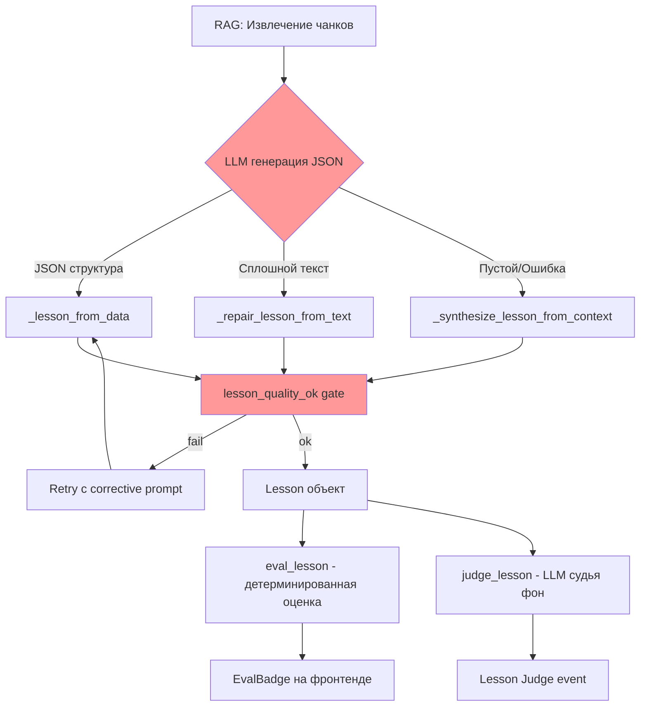

# Архитектурный анализ качества генерации уроков EduTutor

## Executive Summary

Пользователь жалуется на посредственное качество генерируемых уроков. Выявлено **6 критических проблем** с корневыми причинами и предложениями по исправлению.

---

## Проблема 1: "Цитаты: 0/10" при наличии цитат из стихов

### Описание
Система оценки показывает `цитаты: 0/10`, хотя в уроке присутствуют цитаты из стихотворений.

### Root Cause Analysis

**Файл:** [`src/lesson_eval.py:82-86`](src/lesson_eval.py:82)

```python
def _score_citations(lesson: Lesson) -> float:
    if not lesson.sections:
        return 0.0
    with_cit = sum(1 for s in lesson.sections if (s.citation or "").strip())
    return round(with_cit / len(lesson.sections), 3)
```

**Корневая причина:** Метрика `_score_citations` проверяет наличие непустого поля `s.citation` (номер параграфа типа "§5") в каждой секции урока. Цитаты из стихов находятся в поле `s.body`, а НЕ в поле `s.citation`.

**Как это работает:**
1. LLM генерирует секцию с цитатой стиха в поле `body`: `"Поэт писал: «Бываю даже грубым, друг: / Излишняя, сударыня, вам нежность...»"`  
2. Поле `citation` остаётся пустым (`""`), так как LLM не указывает номер параграфа для цитаты
3. `_score_citations` видит 0 секций с цитатой → возвращает `0.0`
4. Фронтенд отображает `0/10`

**Дополнительная проблема:** Даже если LLM укажет `citation: "§5"`, метрика считает только долю секций С цитатой, а не глубину анализа цитат. Цитата без контекста и анализа получает ту же оценку, что и цитата с полным разбором.

### Severity: 🔴 HIGH

### Recommendation
1. **Расширить определение "цитаты":** Проверять наличие цитатного оформления (`«»`, `„“`, дефиса диалога) ИЛИ тега авторского слова в `s.body`
2. **Добавить новую метрику `citations_depth`:** Оценивать наличие анализа/контекста вокруг цитаты
3. **Обновить промпт:** Явно указать LLM, что цитаты из литературы ОБЯЗАТЕЛЬНО должны сопровождаться полем `check_question` с вопросом на понимание

---

## Проблема 2: "Часть 1" показывает метаданные автора вместо содержимого

### Описание
Первая секция урока содержит текст "Настоящий материал опубликован пользователем Гарипова Екатерина Юрьевна" — это метаданные источника, а не учебный контент.

### Root Cause Analysis

**Файлы:**
- [`src/tutor.py:616-641`](src/tutor.py:616) — `_repair_lesson_from_text()` 
- [`src/tutor.py:725-786`](src/tutor.py:725) — `_synthesize_lesson_from_context()`
- [`src/tutor.py:643-696`](src/tutor.py:643) — `lesson_quality_ok()`

**Корневая причина:** Когда LLM не может структурировать урок в JSON (возвращает сплошной текст или пустую структуру), система переходит в режим repair (`_repair_lesson_from_text`). Этот метод разделяет текст по переносам строк и использует первые абзацы как секции. Метаданные автора из скрапированного веб-контента попадают в первый абзац и становятся первой секцией.

**Путь данных:**
1. RAG извлекает чанки из веб-источника (stolitsa.ru или подобный сайт)
2. Чанк содержит HTML-текст с метаданными: `"Настоящий материал опубликован пользователем Гарипова Екатерина Юрьевна"`
3. LLM не может создать структурированный JSON → fallback → `_repair_lesson_from_text`
4. Первый абзац = метаданные автора → первая секция урока

**Защитные фильтры НЕ сработали:**
- [`src/tutor.py:674-679`](src/tutor.py:674): `lesson_quality_ok()` проверяет `_is_slide_chrome()` и `_is_title_fragment()`, но НЕ проверяет авторские метаданные
- [`frontend/src/components/LessonPanel.jsx:188-207`](frontend/src/components/LessonPanel.jsx:188): `isNoiseSection()` фильтрует навигационный мусор, но строки с именами авторов не попадают в `NAV_WORDS`

### Severity: 🔴 HIGH

### Recommendation
1. **Добавить фильтр авторских метаданных в `lesson_quality_ok()`:**
   ```python
   _AUTHOR_CHROME_RE = re.compile(
       r"^(опубликован|автор|доклад|реферат|работа|учитель|преподаватель)"
       r".*(пользователем|автор[ау]|Гарипова|Менделев)",
       re.IGNORECASE
   )
   ```
2. **Усилить `_synthesize_lesson_from_context()`:** Фильтровать предложения с паттернами авторских метаданных
3. **Улучшить очистку RAG-чанков на этапе индексации:** Очищать навигацию и метаданные до попадания в векторную базу

---

## Проблема 3: "Определение" слишком краткое

### Описание
Определение: "Поэты серебряного века создали грандиозный поэтический капитал" — одно предложение,缺少 контекста и пояснения.

### Root Cause Analysis

**Файл:** [`src/tutor.py:415-473`](src/tutor.py:415) — `_lesson_prompt()`

```python
'definition": "Краткое определение темы в 1-2 простых предложениях.",
```

**Корневая причина:** Промпт явно требует "Краткое определение ... в 1-2 простых предложениях". Это ограничивает LLM, заставляя давать слишком сжатое определение вместо развёрнутого объяснения темы.

**Дополнительная проблема:** В retry-промпте [`src/tutor.py:709-720`](src/tutor.py:709) указано:
```
1. "definition" — целое предложение (минимум 8 слов)
```
"Минимум 8 слов" — слишком мало для содержательного определения. Для темы "Поэты Серебряного века" определение должно включать: временные рамки, ключевые характеристики, основные направления.

### Severity: 🟡 MEDIUM-HIGH

### Recommendation
1. **Изменить промпт на развёрнутое определение:**
   ```
   "definition": "Развёрнутое определение темы: 3-5 предложений, охватывающих 
   ключевые аспекты (временные рамки, основные черты, представители). Простым языком."
   ```
2. **Динамическая длина:** Установить минимум не в словах, а в символах (≥200 символов для сложных тем)
3. **Добавить пример хорошего определения** в system prompt (few-shot learning)

---

## Проблема 4: "Итог" слишком краткий

### Description
Итог: "Поэзия Серебряного века открывает нам неповоротимый и удивительный мир красоты и гармонии" — generic фраза без конкретики.

### Root Cause Analysis

**Файл:** [`src/tutor.py:415-473`](src/tutor.py:415) — `_lesson_prompt()`

```python
'"summary": "Итог в 1-2 предложениях."'
```

**Корневая причина:** Аналогично проблеме с определением — промпт ограничивает итог 1-2 предложениями. LLM генерирует шаблонную фразу, так как в 1-2 предложениях невозможно резюмировать содержание урока.

**Дополнительная проблема:** Нет принудительной привязки итога к содержанию конкретных секций. Логично требовать, чтобы итог подвел результаты по КАЖДОЙ секции.

### Severity: 🟡 MEDIUM-HIGH

### Recommendation
1. **Изменить промпт:**
   ```
   "summary": "Итог урока: 3-4 предложения. Кратко резюмируйте каждый раздел, 
   затем общее значение темы. Конкретика, не общие фразы."
   ```
2. **Валидация итога:** В `lesson_quality_ok()` проверить, что summary содержит конкретные термины из секций, а не generic фразы

---

## Проблема 5: Цитаты из стихов без контекста, анализа, пояснения

### Description
Цитаты помещены в секции без анализа, пояснения смысла, исторического контекста.

### Root Cause Analysis

**Файл:** [`src/tutor.py:415-473`](src/tutor.py:415) — `_lesson_prompt()`

Промпт требует от LLM:
```python
'"sections": [
  {
    "heading": "Подтема 1",
    "body": "Объяснение 2-4 предложения простыми словами.",
    "citation": "§5",
    "check_question": "Вопрос на понимание после этой секции?"
  }
]'
```

**Корневая причина:** Промпт ограничивает body секции "2-4 предложения простыми словами". Это слишком мало для размещения цитаты + анализа. LLM вынуждена выбирать: либо вставить цитату, либо добавить анализ. Обычно выбирается цитата, анализ опускается.

**Дополнительная проблема:** Нет явного требования в промпте进行分析 цитат. LLM не знает, что нужно объяснять смысл стихов, указывать авторство, литературный приём.

**Структурное ограничение:** Максимум 3 секции (`Минимум 1 секция, максимум 3 (не больше!)`) — недостаточно для темы, которая требует: введения, анализа произведений 1, анализа произведений 2, исторического контекста, заключения.

### Severity: 🔴 HIGH

### Recommendation
1. **Увеличить лимит секций до 5:** Для гуманитарных тем с цитатами нужно больше пространства
2. **Изменить требование к body:** 
   ```
   "body": "Объяснение 5-8 предложений. Если включаете цитату: 
   1-2 предложения введения → цитата → 2-3 предложения анализа (смысл, приём, контекст)."
   ```
3. **Добавить явное требование анализа цитат:**
   ```
   "Каждая цитата ДОЛЖНА быть окружена анализом: перед цитатой — введение, 
   после — разбор смысла и литературных приёмов."
   ```
4. **Добавить поле `analysis` в `LessonSection`:** Для структурированного хранения анализа отдельно от цитаты

---

## Проблема 6: Общая оценка структуры 7/10 при плохом качестве

### Description
Система показывает `структура 7/10` несмотря на наличие метаданных автора, кратких секций и отсутствия анализа.

### Root Cause Analysis

**Файл:** [`src/lesson_eval.py:62-79`](src/lesson_eval.py:62) — `_score_structure()`

```python
def _score_structure(lesson: Lesson) -> float:
    s = 0.0
    if lesson.hook:
        s += 0.2
    if lesson.definition:
        s += 0.2
    n = len(lesson.sections)
    if 2 <= n <= 4:
        s += 0.25
    elif n == 1:
        s += 0.15
    elif n >= 5:
        s += 0.1
    if lesson.summary:
        s += 0.2
    if lesson.key_terms:
        s += 0.15
    return round(s, 3)
```

**Корневая причина:** `_score_structure` проверяет только ПРИСУТСТВИЕ полей, но НЕ их качество:
- `lesson.hook` → "+0.2" (присутствует ли любой hook)
- `lesson.definition` → "+0.2" (любая непустая строка)
- `n == 3 секций` → "+0.25"
- `lesson.summary` → "+0.2"
- Итого: 0.85/1.0 ≈ 7-8/10

**Это формальная проверка, а не качественная.** Урок с метаданными автора и одним предложением в каждой секции получает тот же балл, что и хорошо структурированный урок.

### Severity: 🟡 MEDIUM

### Recommendation
1. **Добавить.quality checks в `_score_structure`:**
   - Минимальная длина definition (≥150 символов)
   - Наличие heading в каждой секции
   - Минимальная длина каждой секции body (≥100 символов)
   - Отсутствие noise-секций (метаданные, навигация)
2. **Штраф за quality violations:** Вычесть баллы за шум в секциях

---

## Архитектурные проблемы высшего уровня

### A. Одноуровневая система оценки

**Текущая архитектура:**
```
eval_lesson() → детерминированные эвристики (0 LLM вызовов)
judge_lesson() → LLM-судья (фоном, для groundedness)
```

**Проблема:** Детерминированная оценка слишком простая и не улавливает смысловые проблемы. LLM-судья работает фоном и показывает groundedness (соответствие источнику), а не pedagogical quality (педагогическое качество).

**Рекомендация:** Добавить промежуточный уровень — lightweight LLM-оценку педагогического качества сразу после генерации урока (без фона), которая проверяет:
- Содержательность определений
- Глубину анализа цитат
- Отсутствия шума в секциях
- Связность между секциями

### B. Жёсткие ограничения в промптах

**Текущие ограничения:**
- Definition: 1-2 предложения
- Body: 2-4 предложения  
- Summary: 1-2 предложения
- Max sections: 3

**Проблема:** Эти ограничения хороши для простых фактологических тем (география, история дат), но катастрофичны для гуманитарных тем с анализом литературы. Нельзя учить Анализ стихотворения в 2-4 предложениях!

**Рекомендация:** Динамическая параметризация промптов в зависимости от предметной области:
```python
def _lesson_prompt(topic, context, grade, curriculum, subject=None):
    if subject in ("литература", "русский язык"):
        max_sections = 5
        definition_min_chars = 200
        require_quote_analysis = True
    else:
        max_sections = 3
        definition_min_chars = 100
        require_quote_analysis = False
```

### C. Отсутствие feedback loop от оценки к генерации

**Текущий поток:**
```
LLM генерирует урок → eval_lesson() (оценка) → показ пользователю
```

**Проблема:** Оценка вычисляется ПОСЛЕ генерации и только показывается пользователю. Не используется для улучшения текущей или следующей генерации.

**Рекомендация:** Добавить self-reflection:
```
LLM генерирует урок → eval_lesson() → если citations < 0.5 → 
  корректирующий промпт → LLM перегенерирует секции с цитатами
```

### D. RAG-очистка на уровне чанков

**Проблема:** Метаданные авторов, навигация сайта, реклама попадают в RAG-чанки и затем в урок. Очистка происходит частично в [`src/knowledge.py`](src/knowledge.py: `_is_slide_chrome`, `_is_slideshow_text`, `_is_web_noise`), но недостаточно полно.

**Рекомендация:** 
1. Усилить очистку на этапе индексации (при загрузке учебника)
2. Добавить post-filtering для RAG-результатов: удалять чанки с паттернами шума
3. Валидация чанков перед отправкой в LLM

---

## Сводная таблица проблем

| # | Проблема | Файл | Строки | Severity |
|---|----------|------|--------|----------|
| 1 | Цитаты: 0/10 при наличии цитат | [`lesson_eval.py`](src/lesson_eval.py) | 82-86 | 🔴 HIGH |
| 2 | Метаданные автора в секции 1 | [`tutor.py`](src/tutor.py) | 616-641 | 🔴 HIGH |
| 3 | Определение слишком краткое | [`tutor.py`](src/tutor.py) | 428 | 🟡 MEDIUM-HIGH |
| 4 | Итог слишком краткий | [`tutor.py`](src/tutor.py) | 441 | 🟡 MEDIUM-HIGH |
| 5 | Цитаты без анализа | [`tutor.py`](src/tutor.py) | 433-439 | 🔴 HIGH |
| 6 | Структура 7/10 при плохом качестве | [`lesson_eval.py`](src/lesson_eval.py) | 62-79 | 🟡 MEDIUM |

---

## Prioritized Roadmap Исправлений

### Phase 1: Quick Wins (Недель 1-2)

1. **[P0]** Усилить фильтры шума: добавить `_is_author_chrome()` в [`tutor.py`](src/tutor.py) и [`knowledge.py`](src/knowledge.py)
2. **[P0]** Исправить `_score_citations()`: считать цитаты с оформлением `«»` в body
3. **[P1]** Увеличить min chars для definition с "8 слов" до "150 символов"

### Phase 2: Prompt Engineering (Неделя 3)

4. **[P0]** Обновить `_lesson_prompt()`: увеличить лимиты для литературы
5. **[P1]** Добавить requirement анализа цитат в промпт
6. **[P1]** Expand definition/summary до 3-5 предложений

### Phase 3: Architecture Improvements (Недели 4-6)

7. **[P1]** Динамическая параметризация промптов по предмету
8. **[P2]** Feedback loop: self-reflection после оценки
9. **[P2]** Улучшить RAG-очистку на этапе индексации

---

## Диаграмма текущего потока генерации и оценки



**Красные зоны:** Проблемные места
**Жёлтые зоны:** Возможности улучшения

---

## Рекомендации по диаграмме (diagram scoring)

**Файл:** [`lesson_eval.py:89-120`](src/lesson_eval.py:89) — `_score_diagram()`

Отдельно отмечу: текущая метрика диаграммы оценивает согласованность узлов с текстом через token overlap. Это разумная эвристика, но:
- Не учитывает semantica значимость diagram (насколько схема дополняет текст)
- Не проверяет корректность связей (edges) кроме existence check

**Recommendation:** Добавить проверку semantic coverage: все key concepts из text должны быть представлены в diagram nodes.
