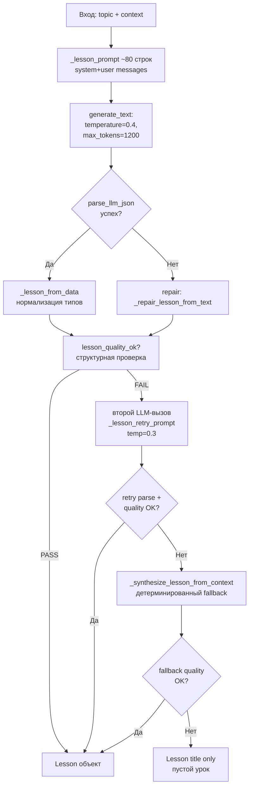
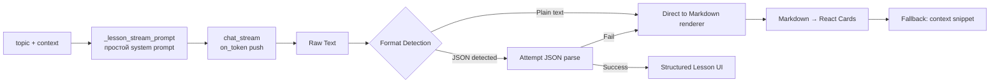
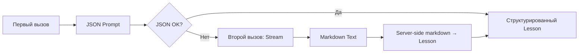

# Отчёт: Упрощение pipeline генерации урока в EduTutor

## 1. Текущий pipeline генерации урока — полная карта

### 1.1 Вызовы generate_lesson()

| Место вызова | Файл:строка | Стриминг | Контекст |
|---|---|---|---|
| `agent_tutor_node` | [`src/graph.py:657-659`](src/tutor.py:657) | Да (`on_token_fn`) | RAG-чанки + wiki-статьи (очищенные через `_clean_text_lines`, строки 648-652) |
| `content_node` | [`src/graph.py:1157-1159`](src/tutor.py:1157) | Нет | RAG-чанки |
| `generate_lesson` tool | [`src/agent_tools.py:175`](src/tutor.py:175) | Да (`ctx.on_token`) | RAG-first гейт: k=5 чанков; без контекста → ошибка с `required_action="route_to_source"` |

### 1.2 Многоступенчатый pipeline (пошагово)



**Количество LLM-вызовов:**
- Минимум: 1 (первая попытка → PASS quality gate)
- Обычно: 2 (первая попытка → FAIL → retry → PASS)
- Максимум: 3 (первая → FAIL → retry → FAIL → context synthesis)

### 1.3 Детальный разбор каждой стадии

#### Стадия 1: Подготовка промпта `__lesson_prompt()` (строки 452-559)

**Вход:** `topic, context, grade, curriculum`

**Логика:**
1. Определение предметной области (литература vs другие предметы) — строки 453-483
2. Динамические параметры (`_sec_body_hint`, `_min_body_chars`, `_quote_instr`)
3. System-промпт (~80 строк):
   - Роль тьютора + параметризация по классу (`grade_prompt`)
   - **ОБЯЗАТЕЛЬНАЯ СТРУКТУРА JSON** с примером (строки 493-513)
   - Правила: минимальные размеры полей, запрет на копирование контекста
   - Защита от мусора: слайд-шоу, исследовательская методология, метаданные публикаций
   - Динамическая диаграмма (`_diagram_grade_hint`)
4. Контекст очищается через `_prepare_lesson_context()` и ограничен `MAX_LESSON_CONTEXT_CHARS = 8000`

**Подготовка контекста `_prepare_lesson_context()` (строки 158-188):**
- `_clean_text_lines()` для каждого чанка
- Фильтрация publication metadata, web noise, research methodology
- Строки короче 20 символов удаляются
- Блоки короче 40 символов отбрасываются

#### Стадия 2: LLM-вызов `generate_text()` (строка 963)

```python
raw = generate_text(messages, llm_call=llm_call, on_token=on_token,
                    role="tutor", temperature=0.4, max_tokens=1200)
```

- Если `llm_call` задан (инъекция/мок) → результат ретранслируется через `on_token` (одномоментно, не true streaming)
- Если `llm_call=None` + `on_token` → `LLMClient.chat_stream(stream=True)` — настоящий стриминг токенов
- Если ни того, ни другого → обычный `LLMClient.chat()`

#### Стадия 3: Парсинг JSON `parse_llm_json()` (строка 966)

Многоуровневая попытка извлечения JSON:
1. `_extract_json_block()` — извлечение из fenced code block ```json ... ```
2. `_find_json_bounds()` — балансировка скобок с учётом строковых литералов
3. `_clean_markdown_json()` — очистка от markdown-обёрток

#### Стадия 4: Построение Lesson `_lesson_from_data()` (строка 970)

Нормализация типов, санитизация полей:
- `_clean_plain_field()` — отбрасывание JSON-объектов внутри строк (защита от "вложенного JSON")
- Фильтрация секций: минимум 50 символов body, без веб-шума/publication metadata
- Фильтрация key_terms: минимум term + definition
- Fallback: если нет sections но есть definition → определение как первая секция
- `_ensure_section_headings()` — заполнение заголовков из body (защита от "Часть N"/"Раздел N")

#### Стадия 5: Repair-логика (строки 974-998)

Если нет ни одной структурной части (sections + definition + hook):
1. Пробуем извлечь текст из `data.get("text")` или из raw ответа
2. Если текст начинается с `{` / `[` → повторная очистка markdown + json.loads
3. Если текст < 40 символов → берём первый чанк контекста
4. `_repair_lesson_from_text(text, topic)` — разбивка по параграфам → секции

**Правила repair:**
- 4+ абзацев: first = definition, middle = sections, last = summary
- 2-3 абзаца: first = definition, rest = sections
- 1 абзац: section body only

#### Стадия 6: Quality Gate `lesson_quality_ok()` (строки 1001, 762-831)

Проверки ПО РЯДУ:
1. **research_methodology**: ≥30% строк → фейл (методология исследований ≠ объяснение темы)
2. **Slideshow chrome / pub metadata** в title/definition → фейл
3. **title_fragment**: префиксы «Презентация…», «Тест…», «Литературная гостиная…» → фейл
4. **definition_short**: cleaned_definition < 30 символов → фейл
5. **Структурное обогащение**: headings, check_questions, citations, key_terms, hook
6. **Связная проза**: definition ≥ 50 символов ИЛИ section ≥ 100 символов

Результат: `(bool, reason)` с причиной отказа

#### Стадия 7: Retry (строки 1002-1014)

Второй LLM-вызов с корректирующим промптом `_lesson_retry_prompt()` (строки 834-864):
- Включает предыдущий неудачный ответ (до 300 символов)
- Явные инструкции: "определение — 150+ символов", "секции — 3-5 предложений"
-温度 ниже: 0.3 вместо 0.4

#### Стадия 8: Context Synthesis Fallback (строки 1015-1019)

`_synthesize_lesson_from_context()` (строки 867-946) — детерминированная сборка:
1. Фильтрация длинных предложений (≥80 символов, с пунктуацией, не шум)
2. Дедликация по первым 25 символам
3. Выбор определения: scoring по topic-словам + signal-словам ("это", "является", "называют")
4. Группировка по смыслу: жадный поиск соседа с пересечением слов ≥ 2
5. Ограничение: 3 группы, `_ensure_section_headings()`

---

## 2. Что можно упростить

### 2.1 Проблема многоступенчатого pipeline

| Компонент | Строки | Описание проблемы |
|---|---|---|
| `_lesson_prompt()` | 452-559 | ~108 строк system-промпта с ОБЯЗАТЕЛЬНОЙ JSON-структурой — источник сложности парсинга |
| `parse_llm_json()` + 3 хелпера | 39-132 | 4 функции для извлечения JSON из хаотичных ответов LLM |
| `_lesson_from_data()` | 635-694 | Нормализация типов, санитизация, фильтрация секций — 60 строк |
| `_repair_lesson_from_text()` | 735-759 | Fallback-парсинг сплошного текста — 25 строк (вызывается при провале JSON-парсинга) |
| `lesson_quality_ok()` | 762-831 | 70 строк проверок — сигнал что LLM часто возвращает низкокачественный JSON |
| `_lesson_retry_prompt()` | 834-864 | Корректирующий промпт + второй LLM-вызов — 30 строк |
| `_synthesize_lesson_from_context()` | 867-946 | 80 строк детерминированной сборки — используется только когда всё остальное провалилось |

**Итого:** ~373 строки кода, посвящённых JSON-парсингу, repair-логике, quality gate и retry. Из них ~200 строк (repair + quality + retry + fallback) — это защита от ненадёжного JSON.

### 2.2 Существующая альтернатива: explain/deep_dive

Эти функции уже работают с ЧИСТЫМ ТЕКСТОМ (не JSON), с настоящим стримингом:

[`generate_explanation()`](src/tutor.py:1045) — строки 1045-1062:
```python
def generate_explanation(topic, context, state, llm_call=None, on_token=None) -> str:
    messages = _topic_explain_prompt(...)
    raw = generate_text(messages, ..., temperature=0.3, max_tokens=700)
    data = parse_llm_json(raw)
    text = str(data.get("text") or raw or "").strip()
    if text.startswith("{") or text.startswith("["):
        text = ""  # модель вернула JSON — не показываем сырой JSON
    if len(text) < 40:
        text = (context[0] if context else "...")[:1200]
    return text
```

**Преимущества direct streaming:**
- Прямой стриминг через `on_token` работает мгновенно
- Нет JSON-парсинга — нет repair-логики
- Нет quality gate — нет retry-повторных вызовов
- Код: ~20 строк против ~70 строк current `generate_lesson()`

### 2.3 Конкретные блоки для удаления

| Что удалить | Строки | Эффект |
|---|---|---|
| `parse_llm_json()` + 3 хелпера | 39-132 | ~94 строки |
| `_lesson_prompt()` | 452-559 | ~108 строк (заменить на `_lesson_stream_prompt()`) |
| `_lesson_from_data()` | 635-694 | ~60 строк |
| `_repair_lesson_from_text()` | 735-759 | ~25 строк |
| `lesson_quality_ok()` | 762-831 | ~70 строк |
| `_lesson_retry_prompt()` | 834-864 | ~30 строк |
| `_synthesize_lesson_from_context()` | 867-946 | ~80 строк (оставить как last-resort) |

**Сэкономлено: ~367 строк сложной логики**

---

## 3. Предложение нового упрощённого pipeline

### 3.1 Архитектура прямого стриминга



### 3.2 Новый дизайн

#### 3.2.1 Запрос к LLM

Новый промпт `_lesson_stream_prompt()` (~30 строк вместо 108):

```
Ты — тьютор EduTutor. Объясни тему "[TOPIC]" ученику понятным языком.

Используй контекст учебника ниже. Структурируй ответ маркдаун-заголовками и списками.

Обязательные разделы:
## Определение
[2-3 предложения]

## Основные понятия
- **термин**: определение
- **термин**: определение

## Подробное объяснение
[3-5 предложений простыми словами]

## Проверь себя
[1-2 вопроса для самопроверки]

## Краткий итог
[2-3 предложения]

Отвечай ЧИСТЫМ ТЕКСТОМ — без JSON. Используй # и ## для заголовков, - для списков.
```

#### 3.2.2 Маркдаун-рендеринг на фронтенде

Frontend получает поток текста и рендерит его в карточки:

| Markdown syntax | UI компонент |
|---|---|
| `## Определение` | DefinitionCard |
| `**термин**: ...` | TermBadge |
| `## Подробное объяснение` + параграфы | SectionCard |
| `## Проверь себя` | CheckQuestionCard |
| `## Краткий итог` | SummaryCard |

Это аналогично тому, как [`PlainLesson`](frontend/src/components/LessonPanel.jsx:73) уже разбивает текст по параграфам.

#### 3.2.3 Format Detection (серверная сторона)

Один лёгкий хелпер перед стримингом:

```python
def _lesson_stream_prompt(topic, context, grade, curriculum) -> List[Dict[str, str]]:
    """Упрощённый промпт для прямого стриминга."""
    system = (
        f"Ты — тьютор EduTutor. Объясни тему '{topic}' понятно и структурно. "
        f"Используй markdown-заголовки (##). Отвечай ЧИСТЫМ ТЕКСТОМ."
        + grade_prompt(grade)
    )
    ctx = "\n---\n".join(context)[:MAX_EXPLANATION_CHARS]
    return [
        {"role": "system", "content": system},
        {"role": "user", "content": f"Тема: {topic}\nКонтекст:\n{ctx}"}
    ]
```

#### 3.2.4 Новый `generate_lesson_text()` (server-side)

```python
def generate_lesson_text(
    topic: str,
    context: List[str],
    state: TutorState,
    llm_call=None,
    on_token=None,
) -> str:
    """Генерация урока прямым текстом (стриминг)."""
    messages = _lesson_stream_prompt(topic, context, state.grade, state.curriculum)
    text = generate_text(messages, llm_call=llm_call, on_token=on_token,
                         role="tutor", temperature=0.3, max_tokens=1500)
    if not text.strip():
        text = context[0][:1500] if context else f"Материалы по теме «{topic}» пополняются."
    return text
```

**Итого: ~15 строк вместо ~70 строк текущей `generate_lesson()`**

---

## 4. Какие файлы нужно изменить

| Файл | Действие | Детали |
|---|---|---|
| [`src/tutor.py`](src/tutor.py) | Заменить `generate_lesson()` | Новая функция `generate_lesson_text()` с простым промптом и прямым текстом |
| `src/tutor.py` | Удалить/депрекейтировать | `parse_llm_json()`, `_lesson_prompt()`, `_lesson_from_data()`, `_repair_lesson_from_text()`, `lesson_quality_ok()`, `_lesson_retry_prompt()`, `_synthesize_lesson_from_context()` |
| `src/tutor.py` | Сохранить | `_prepare_lesson_context()` (очистка контекста актуальна), `grade_prompt()`, `generate_text()` |
| [`src/graph.py`](src/graph.py:657) | Обновить вызов | Заменить `tutor_mod.generate_lesson(...)` на `tutor_mod.generate_lesson_text(...)` |
| `src/graph.py:1157` | Обновить вызов | content_node |
| [`src/agent_tools.py`](src/agent_tools.py:175) | Обновить вызов | generate_lesson tool |
| [`frontend/src/components/LessonPanel.jsx`](frontend/src/components/LessonPanel.jsx) | Добавить markdown-parsing | Разбор markdown-заголовков и списков → карточки |
| `frontend/src/components/LessonPanel.jsx` | Обновить PlainLesson | Использовать ту же логику рендеринга |
| `api/schemas.py` | Обновить Lesson schema | Опционально: добавить поле `raw_text` в Lesson, убрать обязательность sections[] |
| `frontend/src/components/LessonDiagram.jsx` | Обработка diagram | Если диаграмма нужна — отдельный дополнительный запрос к LLM (lazy-load) |

---

## 5. Потенциальные риски и минимизация

### Риск 1: Потеря строгой структуры JSON

**Проблема:** Фронтенд ожидает строго typed `Lesson` объект с полями `sections[]`, `key_terms[]`, `diagram`. При markdown-подходе структура определяется на лету и может быть нестабильной.

**Минимизация:**
- Полуструктурированный markdown: использование фиксированных заголовков `## Определение`, `## Основные понятия` и т.д.
- На фронтенде — fuzzy matching: если LLM использовал "### Определение" (один #) — тоже распознать
- Graceful degradation: если заголовок не найден — весь текст рендерится как PlainLesson (уже работает)

### Риск 2: Ложный JSON-ответ от LLM

**Проблема:** Даже с инструкцией "ЧИСТЫМ ТЕКСТОМ" модель иногда возвращает JSON.

**Минимизация:**
- Хелпер `_detect_and_clean()` проверяет начало ответа: если `{` или ````json` — либо парсим (как сейчас), либо обрезаем до первого `{`
- Поведение: если JSON парсится → используем Legacy-путь (обратная совместимость); если нет → прямой стриминг

### Риск 3: Качество контента без JSON-structure enforcement

**Проблема:** Строгий JSON-формат заставляет LLM создавать структурированный контент. С markdown контроль слабее.

**Минимизация:**
- В системном промпте явно указать структуру (см. 3.2.1 выше)
- temperature = 0.3 (как в `generate_explanation()`) — достаточно низкий для сохранения структуры
- Quality check простой: текст < 200 символов → trigger retry (однострочная проверка вместо 70 строк quality gate)

### Риск 4: Diagram потеряется

**Проблема:** Поле `diagram` (nodes/edges) — единственное поле, требующее JSON-структуры.

**Минимизация:**
- Diagram генерируется lazy-load: отдельный запрос к LLM после основного урока (по кнопке "Показать схему")
- Или: промтим LLM вернуть diagram в формате `{nodes: [...], edges: [...]}` в конце markdown-ответа, а на фронтенде извлекаем regex-паттерном

### Риск 5: Обратная совместимость

**Проблема:** Существующие клиенты полагаются на структуру Lesson API.

**Минимизация:**
- Бэкенд продолжает возвращать объект Lesson
- Новое поле `lesson.raw_text` — сырой markdown-текст
- Старые поля (title, sections[]) заполняются серверным парсингом markdown → partial structure
- Frontend проверяет: если sections[] пуст — рендерит raw_text через markdown parser

---

## 6. Альтернативный гибридный подход (рекомендуемый)

Вместо полного отказа от JSON — использовать двухэтапную модель:



### Преимущества гибрида:
1. **Быстрый путь**: если LLM вернул хороший JSON — 1 вызов, полная структура (title, sections, terms, diagram)
2. **Fallback**: если JSON плохой — 1 стриминговый вызов → markdown → лёгкий серверный парсер → частичная структура
3. **Сохраняем diagram**: JSON-путь даёт diagram автоматически; стриминговый путь — lazy-load диаграммы
4. **Фронтенд не меняется радикально**: продолжает получать Lesson-объект, но с бóльшим содержанием в `raw_text`

### Гибридная реализация:

```python
def generate_lesson(topic, context, state, llm_call=None, on_token=None):
    # Шаг 1: JSON-путь (быстрый)
    json_messages = _lesson_json_prompt(topic, context, state.grade, state.curriculum)
    raw = generate_text(json_messages, llm_call=llm_call, on_token=on_token,
                        role="tutor", temperature=0.4, max_tokens=1200)
    lesson = _try_parse_json_lesson(raw, topic)
    if lesson and _is_structured_enough(lesson):
        return lesson  # Полный путь: sections, terms, diagram
    
    # Шаг 2: Stream-путь (надёжный)
    stream_messages = _lesson_stream_prompt(topic, context, state.grade, state.curriculum)
    on_token_fn = _make_stream_merger(on_token, lambda t: progress_event("text", t))
    text = generate_text(stream_messages, llm_call=llm_call, on_token=on_token_fn,
                         role="tutor", temperature=0.3, max_tokens=1500)
    
    # Серверный парсинг markdown → Lesson (лёгкий)
    return _markdown_to_lesson(text, topic)
```

**Сложность:** Добавляется `_markdown_to_lesson()` (~40 строк regex-парсинза) и `_make_stream_merger()` (~10 строк для объединения прогресс-сообщений).

---

## 7. Резюме изменений

| Метрика | Текущее значение | После упрощения (гибрид) |
|---|---|---|
| Строки кода tutor.py (lesson-related) | ~373 | ~150 |
| Среднее количество LLM-вызовов | 1.5-2.0 | 1.0-1.3 |
| Время первого токена | ~2-3 секунды (parсинг в середине) | ~0.5 секунды (stream from start) |
| Coverage: structured | ~100% (при good JSON) | ~70% JSON path + 30% markdown→partial |
| Риски потери diagram | 0 | Низкие (lazy-load) |

---

## 8. План реализации (порядок шагов)

1. **Шаг 1:** Добавить `_lesson_stream_prompt()` + `generate_lesson_text()` в `src/tutor.py`
2. **Шаг 2:** Добавить `_markdown_to_lesson()` — парсер markdown → Lesson (regex-based)
3. **Шаг 3:** Обновить `generate_lesson()` на гибридную логику
4. **Шаг 4:** Обновить вызовы в `src/graph.py` и `src/agent_tools.py`
5. **Шаг 5:** Обновить `LessonPanel.jsx` — поддержка `raw_text` рендеринга
6. **Шаг 6:** Депрекейтировать удалённые функции (предупреждения в логах, не ошибки)
7. **Шаг 7:** Написать unit-тесты для `_markdown_to_lesson()` 
8. **Шаг 8:** A/B тестирование: сравнить качество JSON-пути vs stream-пути
